# 본문 CSS 허용 목록

`ContentCssSchema` 가 본문 `style` 속성에서 살릴 CSS 속성을 정한다. 이 문서는 그 목록을 어떻게 뽑았는지, 다시 재려면 뭘 하면 되는지 적는다.

기준은 하나다. 속성을 빼고 렌더해서 화면이 바뀌면 넣고, 안 바뀌면 안 넣는다. 코퍼스에 많이 등장하는지는 보지 않는다. `cursor` 가 173개 문서에 있지만 지워도 픽셀 하나 안 바뀌는 식이라, 등장 빈도는 기준으로 쓸모가 없었다.

## 배경

본문은 행정실이 한글, 워드, 메일, 웹페이지에서 붙여넣은 HTML 이다. `style` 을 그대로 두면 `position:fixed` 와 `z-index` 로 본문이 페이지 전체를 덮을 수 있고, 통째로 지우면 표와 글자 크기, 정렬이 다 날아간다. 그래서 살릴 속성을 골라야 했다.

바탕은 [OWASP Java HTML Sanitizer](https://github.com/OWASP/java-html-sanitizer) 의 `CssSchema.DEFAULT` 다. 이 목록은 `HtmlPolicyBuilder.allowStyling()` Javadoc 표현대로 "does not allow content to escape its clipping context" 를 목표로 만들어졌다([원문](https://github.com/OWASP/java-html-sanitizer/blob/1b8457f/owasp-java-html-sanitizer/src/main/java/org/owasp/html/HtmlPolicyBuilder.java#L607)). 여기서 시작해 가감했다.

```
CssSchema.DEFAULT              135종
  − font-family, font           −2     (2단계, 폰트)
  + display, float,             +4     (2단계)
    word-break, text-decoration-line
─────────────────────────────────────
ContentCssSchema.INSTANCE      137종
```

## 절차

대상은 2026-09 시점 운영 DB 덤프의 본문 전체다. 본문을 가진 테이블 12개(세미나는 `description` 과 `introduction` 둘)에서 16,651건, 208MB 다. 본문에 박힌 base64 이미지는 `src` 만 1×1 투명 PNG 로 바꾸고 나머지는 그대로 뒀다. 측정 대상은 `style` 속성이라 이미지 내용은 무관하고, 세탁기도 저장 시점에 base64 를 파일로 빼내므로 이쪽이 실제 렌더 경로에 가깝다.

| 단계 | 내용 | 성격 |
|---|---|---|
| 0 | 본문에 등장하는 CSS 속성을 전부 센다 | 집계 |
| 1 | 브라우저가 무시하는 속성을 걸러낸다 | 규칙 |
| 2 | 남은 속성을 전수 렌더 비교해서 픽셀이 같으면 뺀다. 바뀐 것은 하나씩 본다 | 측정 |

1단계는 측정이 아니라 규칙이다. 렌더해서 확인한 건 2단계부터다.

## 0단계: 집계

16,651건 전부의 `style` 속성에서 CSS 속성명을 셌다.

```
등장한 CSS 속성   311종
  71종   허용 목록 안 (137개 중 실제로 쓰이는 것)
 190종   벤더/무시 (1단계에서 제외)
  50종   2단계 측정 대상
```

## 1단계: 브라우저가 무시하는 190종

렌더하지 않고 뺐다.

| 접두사 | 종수 | 예 | 이유 |
|---|---|---|---|
| `mso-` | 119 | `mso-fareast-font-family`(166문서), `mso-pagination`(144), `mso-list`(86) | Word 전용. 브라우저가 파싱하지 않는다 |
| `--*` | 47 | `--tw-translate-x`, `--tw-ring-color` | CSS 커스텀 프로퍼티. 정의만 있고 이걸 읽는 규칙이 뷰어에 없다 |
| `-ms-` | 6 | `-ms-word-break`(94문서) | 구 IE 전용 |
| `-webkit-` | 5 | `-webkit-text-stroke-width`(105문서) | 표준화 전 프리픽스. 뷰어 대상 브라우저에서 표준 속성이 대체하거나 무의미 |
| `hwp` | 1 | `hwp-tab` | 한컴오피스 전용 |
| 기타 | 12 | `orphans`(108), `widows`(106), `tab-stops`, `layout-grid-mode` | 인쇄 전용이거나 사멸한 속성 |

`orphans` 와 `widows` 는 표준 속성이고 인쇄에는 효과가 있다. 화면 렌더에는 영향이 없어서 여기 넣었다. 본문 인쇄 품질을 다루게 되면 다시 볼 항목이다.

## 2단계: 전수 렌더 비교

남은 50종을 그 속성을 쓰는 모든 문서에서 재봤다. 표본 아니고 전수다. 예외는 `font-family`(1,949문서)와 `font`(71문서)인데, 둘은 아래에서 뺄 것으로 정해져 있어 `font-family` 만 120건 표본으로 크기를 확인했다.

```
후보 50종, 쓰는 문서 2,146건(중복 제거), 속성×문서 쌍 3,131
```

### 방법

1. 해당 속성을 쓰는 문서를 뷰어 CSS(`suneditor-contents.css`) 안에서 900px 폭으로 렌더한다.
2. `style` 속성에서 그 선언 하나만 지우고 다시 렌더한다.
3. 두 스크린샷의 픽셀을 비교한다.

높이가 달라지면 100% 로 본다. 레이아웃이 밀린 것이라 픽셀 비율이 의미가 없다. 채널당 8 미만 차이는 안티에일리어싱 잡음으로 보고 무시한다.

속성마다 가장 많이 바뀐 문서의 before / after 와, 바뀐 픽셀만 빨갛게 칠한 diff 를 같이 남긴다. 변화가 0.1% 대인 경우 before/after 를 나란히 놓아도 안 보이고 diff 로만 보인다.

문서를 고를 때 값 조건은 걸지 않았다. `float:none` 처럼 효과가 없을 게 뻔한 값도 포함했다. 어떤 값이 의미 있는지는 측정이 답할 문제고, 미리 걸러내면 그만큼 "모든 문서"라는 주장이 약해진다.

### 결과

50종 중 43종은 그 속성을 쓰는 모든 문서에서 픽셀이 같았다.

| | 문서 | 최악 변화 |
|---|---|---|
| `cursor` | 173 | 0.00% |
| `border-image` | 130 | 0.00% |
| `font-variant-caps` | 106 | 0.00% |
| `text-decoration-style` | 105 | 0.00% |
| `font-variant-ligatures` | 99 | 0.00% |
| `text-decoration-color` | 90 | 0.00% |
| `box-sizing` | 66 | 0.00% |
| `text-decoration-thickness` | 44 | 0.00% |
| `text-decoration-skip-ink` | 43 | 0.00% |
| `font-variant-numeric` | 33 | 0.00% |
| `font-variant-east-asian` | 28 | 0.00% |
| 그 외 32종 | | 0.00% |

`border-image` 는 값이 전부 `none` 계열이고, `font-variant-*` 는 뷰어 폰트에 그 기능이 없다. 43종 합쳐서 1,068문서를 전부 렌더했고 시간 초과는 없었다.

바뀐 7종과, 넣은 근거를 되짚은 4종은 아래에 하나씩 적었다.

| | 문서 | 바뀐 문서 | 최악 | 결정 |
|---|---|---|---|---|
| `word-break` | 157 | 36 | 100% | 넣음 |
| `display` | 170 | 8 | 100% | 넣음 |
| `float` | 42 | 9 | 100% | 넣음 |
| `text-decoration-line` | 81 | 25 | 0.15% | 넣음 |
| `font-family` | 1,949 | 111/120(표본) | 100% | 뺌 |
| `font` | 71 | 62 | 100% | 뺌 |
| `position` | 24 | 1 | 100% | 뺌 |
| `flex-direction` | 5 | 1 | 100% | 뺌 |
| `gap` | 1 | 1 | 100% | 뺌 |
| `font-kerning` | 3 | 1 | 0.66% | 뺌 |
| `opacity` | 10 | 1 | 0.03% | 뺌 |

각 속성마다 가장 많이 바뀐 문서의 before / after 와, 바뀐 픽셀만 빨갛게 칠한 diff 를 남겼다. 0.1% 대 변화는 diff 로만 보인다.

### `word-break` — 넣음

`keep-all` 이 빠지면 한글이 단어 중간에서 끊긴다. 표 안에서는 글자 단위로 줄바꿈되어 세로로 늘어지고, 이 문서는 높이가 1,932px 에서 3,300px 이 됐다.

| 있을 때 | 없을 때 |
|---|---|
| 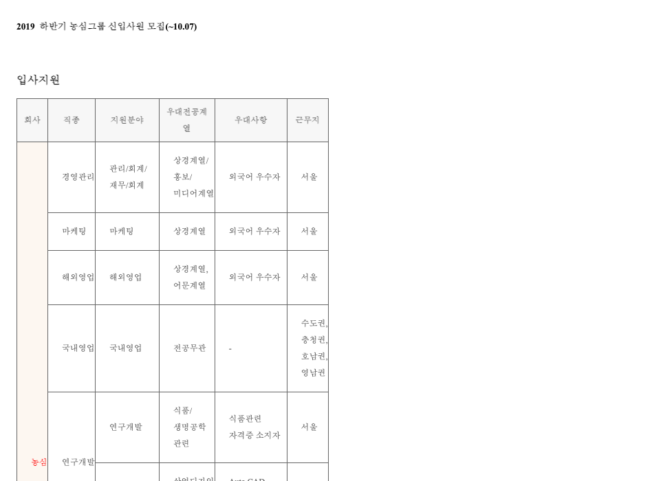 | 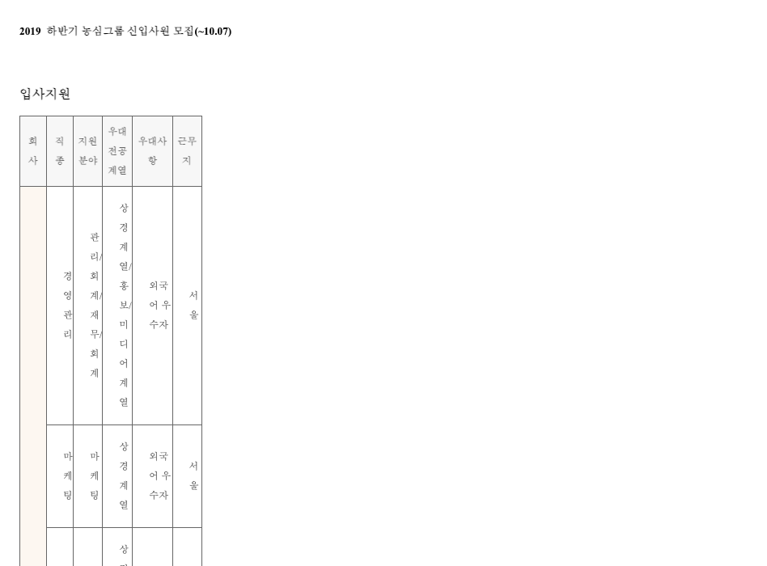 |

### `display` — 넣음

`inline` 이 빠져 한 줄이던 라벨과 값이 두 줄로 쪼개진다.

| 있을 때 | 없을 때 |
|---|---|
| 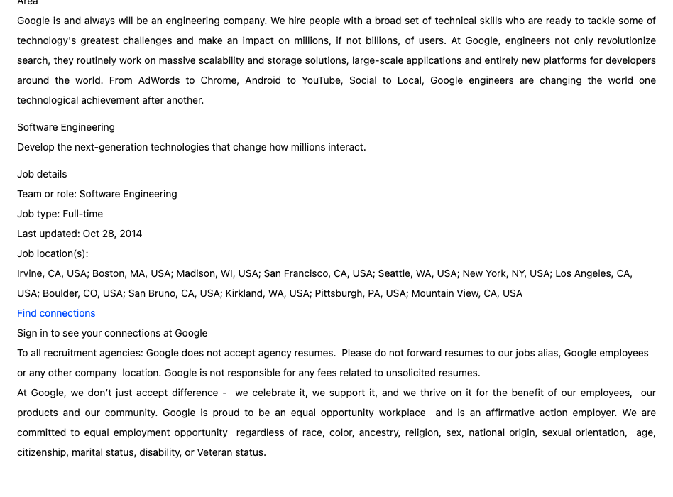 | 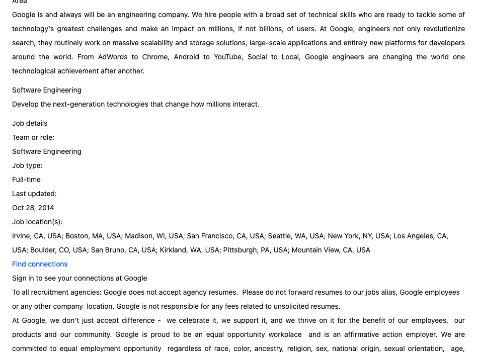 |

속성을 허용하는 대신 문서를 고쳐서 같은 결과를 낼 수 있는지도 봤다. 코퍼스의 `display` 선언은 대부분 태그 기본값과 같다(`<span>`·`<a>` 의 `inline` 121곳, `<p>`·`<figure>`·`<div>` 의 `block` 100곳, `<td>` 의 `table-cell` 등). 실제로 렌더를 바꾸는 건 `<div>`·`<p>` 에 `inline`(4문서), `` 에 `block`(20문서), `inline-block`(6문서)이다. 첫째는 `<span>` 으로 바꾸면 되지만, `` 의 `block` 은 감싸는 요소로 대체해도 아래 여백이 남고 `inline-block` 은 대체할 태그가 없다. 반쪽 변환을 세탁기에 상시로 넣는 것보다 상자를 벗어나지 못하는 속성 하나를 허용하는 쪽이 단순해서 이렇게 뒀다.

이 속성을 잴 때 한 번 틀렸다. 세탁기는 `display:none` 요소를 전처리에서 통째로 지우는데, 측정 스크립트가 그 전처리를 `strip` 뒤에 하고 있었다. `display` 를 지운 쪽에서는 `display:none` 이 없어 숨은 요소가 남고, 그게 렌더에 드러나면서 `display` 의 영향으로 계산됐다. 그렇게 재서 85/142 가 나왔고, 순서를 고치니 8/170 이 됐다. 스크립트는 지금 전처리를 먼저 한다.

### `float` — 넣음

42개 문서에 선언이 105곳 있는데 92곳은 `none` 이고 13곳이 `left` 다. 바뀌는 9개 문서는 전부 `left` 쪽이다. `float:left` 를 떼면 떠 있던 표나 상자가 일반 흐름으로 들어오면서 그 아래 내용을 밀어내고, 밀리는 폭은 10px 에서 360px 까지다.

`float:none` 92곳은 그대로 통과한다. 허용 목록은 속성 단위라 값이 기본값이어도 걸러내지 않는다. 기본값 선언을 따로 지우는 건 세탁이 아니라 정리이고, 그러자면 속성마다 기본값 표를 따로 들어야 해서 넣지 않았다. 남겨 둬도 화면은 같다(바뀐 9문서 모두 `left` 쪽이었다).

`left` 13곳 중 `<table>` 3곳과 `` 2곳은 이미 허용된 `align="left"` 속성으로 바꿀 수 있지만, `<div>` 8곳(7문서)에는 대응하는 속성이 없다. `align` 은 HTML 명세에서 폐기된 속성이기도 해서, 그쪽으로 옮기는 것이 더 낫다고 보기 어렵다. before/after 만 보면 표가 조금 내려간 정도라 짚기 어렵고, diff 에서 밀린 영역이 전부 빨갛게 나온다.

| 있을 때 | 없을 때 | diff |
|---|---|---|
| 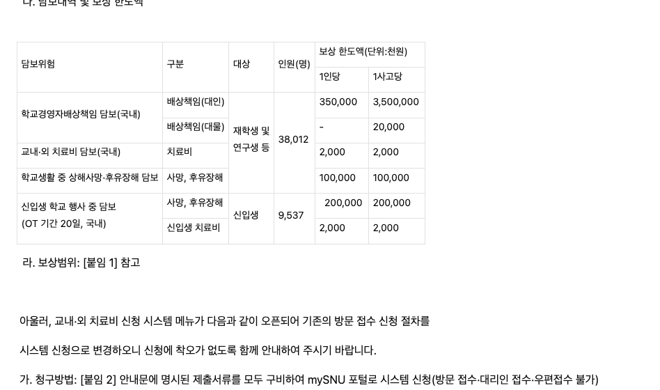 | 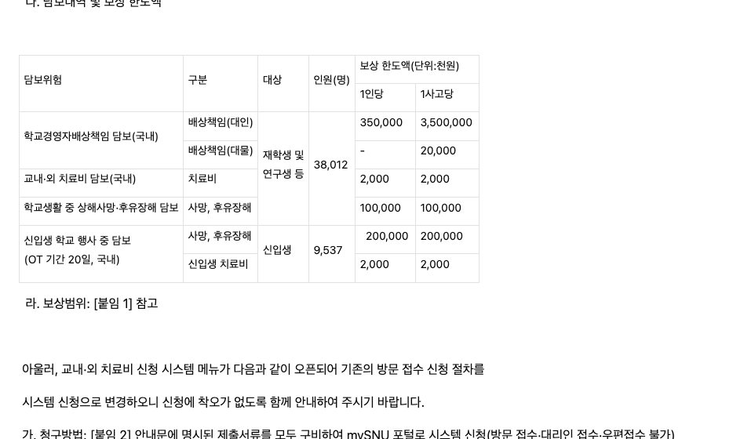 | 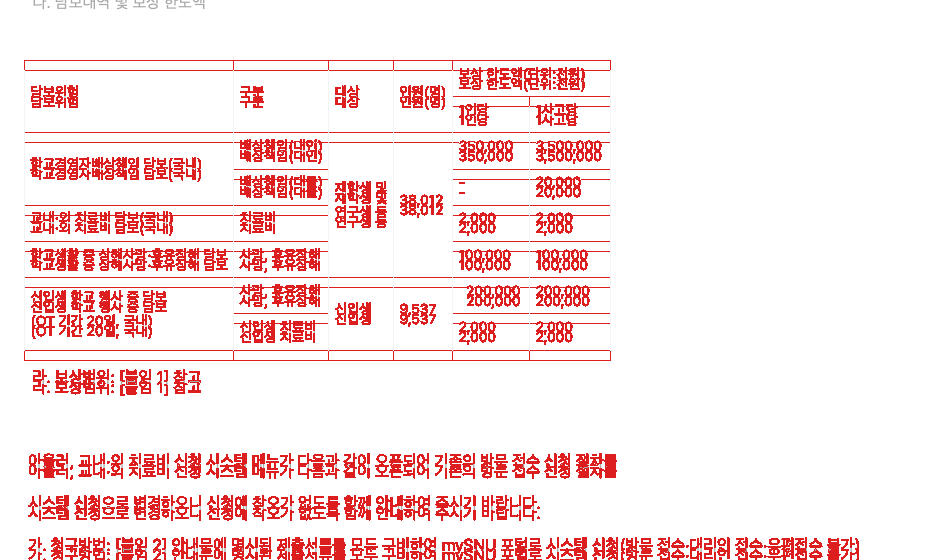 |

### `text-decoration-line` — 넣음

밑줄이 사라진다. 픽셀 변화는 0.15% 지만 25개 문서에서 실제로 사라진다. shorthand `text-decoration` 은 `CssSchema.DEFAULT` 에 있는데 longhand 만 빠져 있었다.

| 있을 때 | 없을 때 | diff |
|---|---|---|
| 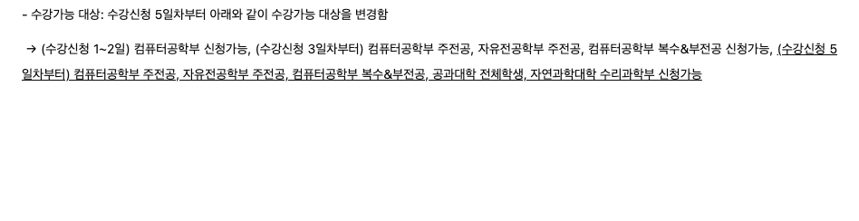 | 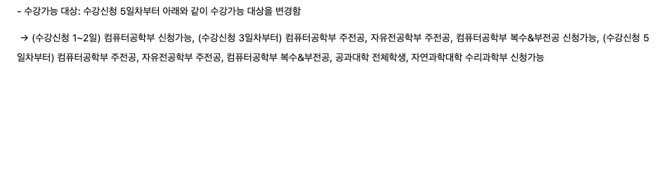 | 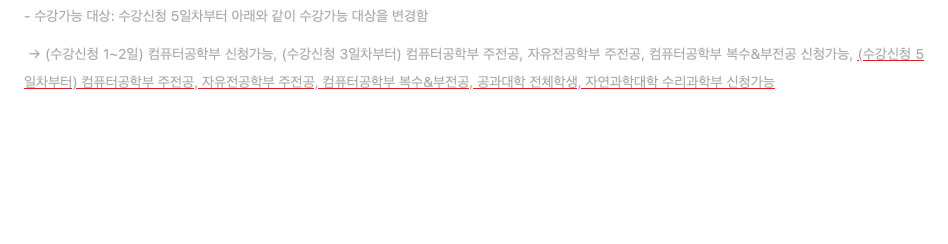 |

### `font-family`, `font` — 뺌

1,949개 문서(전체의 12%)에서 바탕, 굴림, 맑은 고딕 지정이 사라지고 뷰어 기본 폰트가 된다. 표본 120건 중 111건이 바뀐다.

| 있을 때 | 없을 때 |
|---|---|
| 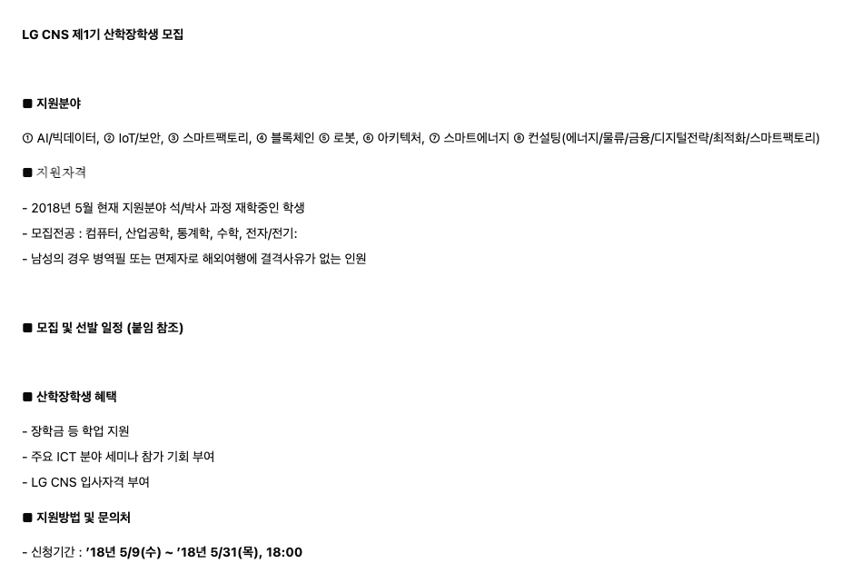 | 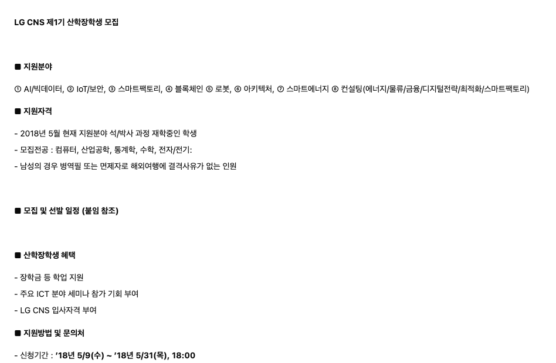 |

폰트 통일은 결정이지 근거는 아니다. 나중에 되돌리자는 이야기가 나올 수 있어서, 되돌리면 안 되는 이유를 적어 둔다.

OWASP 는 따옴표 없는 `font-family: 돋움체` 를 통과시키고, 출력할 때 `'돋움체'` 로 따옴표를 붙인다. 그런데 따옴표 안의 비ASCII 는 같은 토크나이저가 버린다. 두 번째 세탁에서 선언이 사라지고, 그 선언만 있던 요소는 요소째 사라진다.

```
원본   <span style="font-size:14px;font-family:돋움체">주최사 / 활동명</span>
1회    <span style="font-size:14px;font-family:'돋움체'">주최사 / 활동명</span>
2회    <span style="font-size:14px">주최사 / 활동명</span>
```

운영 코퍼스 400건으로 `sanitize(sanitize(x)) == sanitize(x)` 를 재니 위반이 42건(10.5%)이었고, 이 둘을 빼자 0건이 됐다. 세탁은 저장할 때마다 돌기 때문에 멱등하지 않으면 글이 편집될 때마다 조금씩 깎이고, backfill 을 다시 돌릴 수도 없게 된다. `ContentSanitizerTest` 의 멱등성 케이스가 이걸 지킨다. `font` 는 폰트 이름을 포함하는 shorthand 라 같이 뺀다.

### `position` — 뺌

24개 문서가 쓰고 화면이 바뀌는 건 1건이다. Google +1 위젯 잔재인 `<input style="width:1px; height:1px; overflow:hidden; position:absolute; z-index:-1; opacity:0">` 인데, `<input>` 은 허용 태그가 아니라 어차피 제거된다.

| 있을 때 | 없을 때 | diff |
|---|---|---|
| 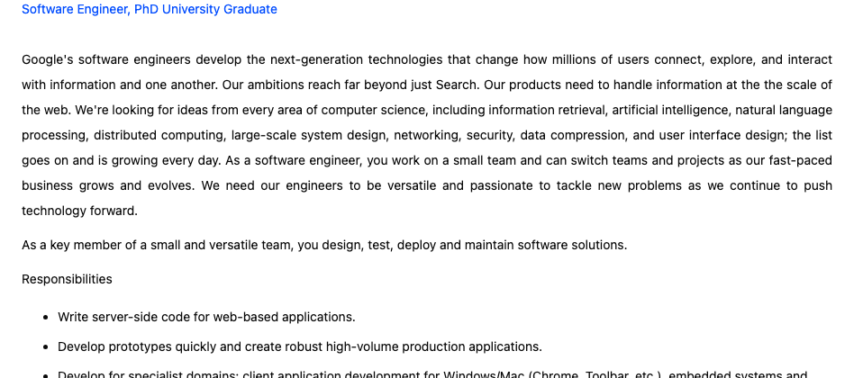 | 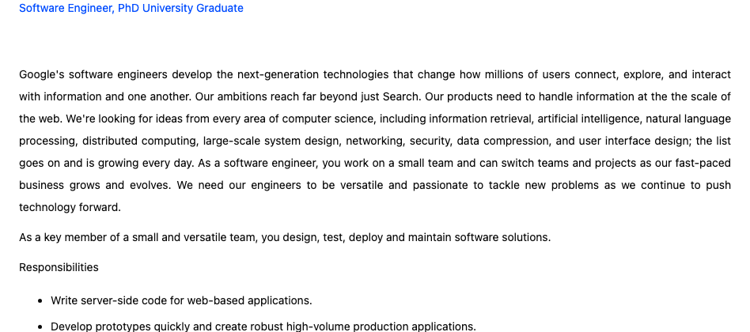 | 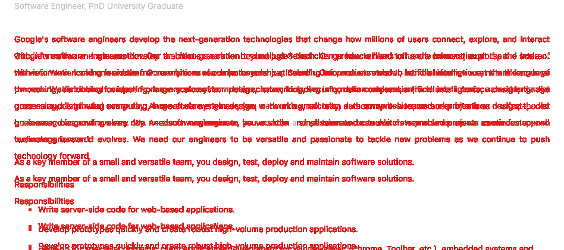 |

이 문서 때문에 빼는 게 아니다. `position:fixed` 와 `z-index` 가 있으면 본문이 페이지를 덮어 로그인 폼을 흉내 낼 수 있다. `CssSchema.DEFAULT` 가 `position` 을 뺀 것도 같은 이유고, 측정 결과와 무관하게 넣지 않는 유일한 속성이다.

### `flex-direction`, `gap` — 뺌

둘 다 문서 24253 하나에서 나온다. 그 문서의 `style` 은 `box-sizing: border-box; margin: 0px; padding: 0px; … --tw-translate-x: 0; --tw-rotate: 0; …` 식의 Tailwind preflight 리셋이다. 웹페이지를 통째로 복사하면서 딸려온 레이아웃이고, `display:none` UI 잔재와 같은 종류다. 규칙대로면 넣어야 하지만, 넣으면 남의 페이지 레이아웃을 우리 본문에 보존하는 셈이라 뺐다.

| 있을 때 | 없을 때 | diff |
|---|---|---|
| 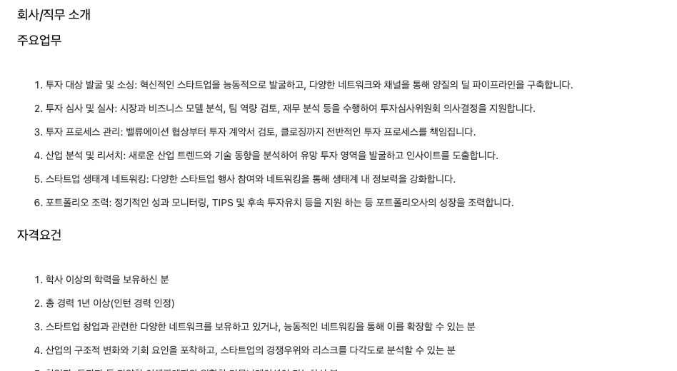 | 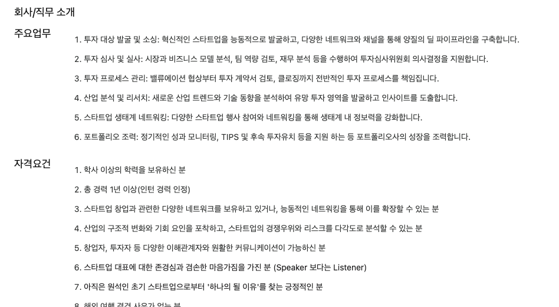 | 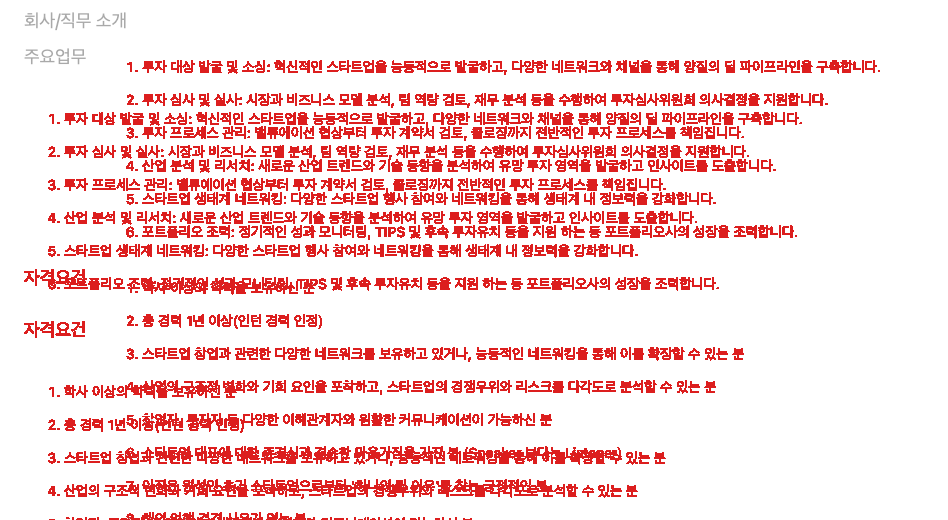 |
| 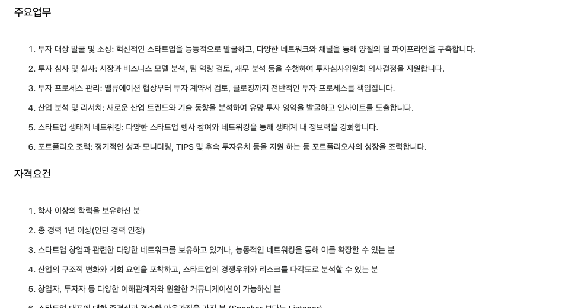 | 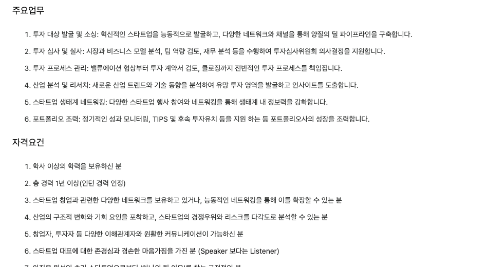 | 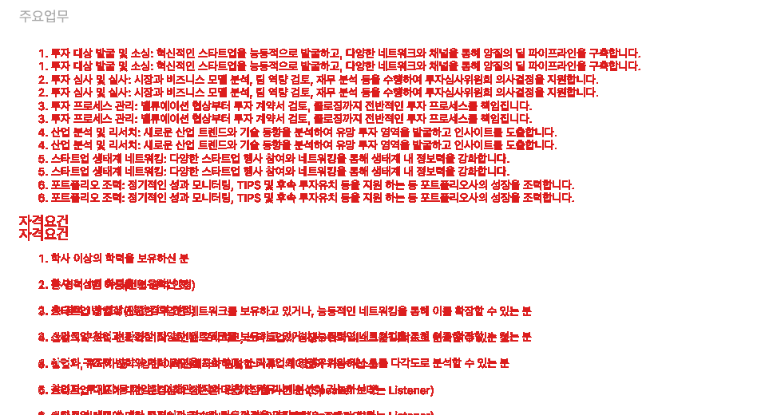 |

### `font-kerning`, `opacity` — 뺌

각각 3개 중 1건(0.66%), 10개 중 1건(0.03%)이 바뀐다. 값이 `font-kerning: auto` 와 `opacity: 1` 로 둘 다 브라우저 기본값이라 있고 없고가 같아야 한다. 렌더 잡음으로 보고 뺐다. `opacity` 는 그림을 뜨느라 다시 렌더했을 때 차이가 아예 안 나왔고(아래 diff 에 빨간 픽셀이 없다), 같은 문서가 돌릴 때마다 결과가 다르면 잡음이다. 틀렸으면 다음 측정에서 잡힌다.

| 있을 때 | 없을 때 | diff |
|---|---|---|
| 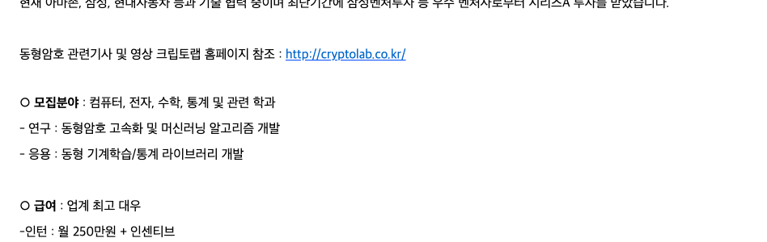 |  | 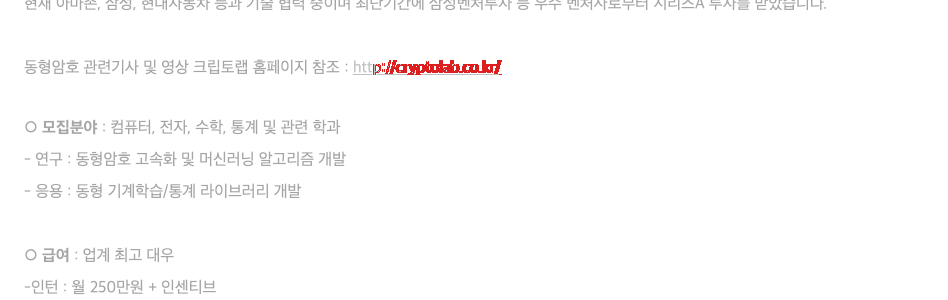 |
|  | 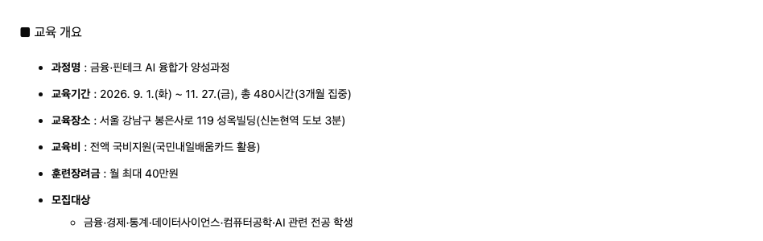 |  |

### `cursor` — 뺌

커서 모양은 스크린샷에 안 찍혀서 이 측정으로는 항상 0.00% 가 나온다. 그래서 값을 봤다. 173개 문서의 선언 749곳 중 `<p>` 의 `cursor: text` 가 549곳으로 텍스트 위 기본 커서와 같고, `pointer` 179곳은 전부 `href` 없는 `<a>`·`<span>`·`` 에 붙어 있어 클릭할 수 없는 곳을 클릭할 수 있는 것처럼 보이게 한다. 진짜 링크(`<a href>`)에 `cursor` 를 단 문서는 없고, 그쪽은 브라우저가 기본으로 pointer 를 준다. 같은 이유로 스크린샷에 안 찍히는 `user-select`(2문서, 기본값), `touch-action`(1문서), `text-size-adjust`(6문서, 모바일 자동 확대 끄기)도 값을 확인하고 뺐다.

## 재현

측정 도구는 두 레포에 나뉘어 있다. 허용 목록은 백엔드에 있지만 브라우저와 뷰어 CSS 는 프론트에 있다.

```
csereal-server/docs/css-allowlist/extract-corpus.py   본문 → 측정용 코퍼스 (의존성 없음)
cse.snu.ac.kr/scripts/measure-css-impact.mjs          렌더 비교 (playwright, sharp)
```

### 1. 본문 추출

운영 덤프를 띄운 컨테이너에서 뽑는다. 본문을 가진 테이블 12개를 `###ROW###<id>###<html>` 형식으로 한 줄씩 잇는다.

```bash
docker exec <db-container> mysql -uroot -p<pw> --default-character-set=utf8mb4 -N --raw -e "
  select concat('###ROW###', id, '###', replace(replace(description,'\n',' '),'\r',' ')) from notice
  union all select concat('###ROW###n', id, '###', replace(replace(description,'\n',' '),'\r',' ')) from news
  union all select concat('###ROW###s', id, '###', replace(replace(description,'\n',' '),'\r',' ')) from seminar
  -- about_translation, academics, admissions, course, internal, recruit,
  -- lab_translation, research_translation, scholarship_translation 도 같은 형식
" > rows.txt
```

### 2. 현재 허용 목록

`ContentCssSchema.INSTANCE.allowedProperties()` 를 한 줄에 하나씩 출력한다. 테스트나 `main` 에서 찍으면 된다. 137줄이 나와야 한다.

### 3. 코퍼스 추출

```bash
# 정책 밖 속성을 쓰는 문서
python3 docs/css-allowlist/extract-corpus.py rows.txt --policy policy.txt --out out.json

# 정책 안 속성 역검증
python3 docs/css-allowlist/extract-corpus.py rows.txt --policy policy.txt \
  --only display,float,word-break,text-decoration-line --out in.json
```

### 4. 렌더 비교

프론트 레포에서 실행한다.

```bash
cd ../cse.snu.ac.kr
node scripts/measure-css-impact.mjs ../csereal-server/out.json --out shots/
```

기본이 전수라 오래 걸린다. 훑어볼 때는 `--samples 12`. 렌더가 15초를 넘는 문서는 세어만 두고 넘어가고(`--timeout` 으로 조정), 실패 건수와 첫 실패 사유가 결과에 같이 찍힌다. `--out` 을 주면 속성마다 `<속성>-before.png`, `-after.png`, `-diff.png` 가 남는다.

실패 사유는 꼭 확인한다. 사유를 찍지 않던 버전에서는 스크립트 버그(`ReferenceError`)가 "렌더 실패 410건"으로 나와서, 측정이 안 된 채로 결과를 읽을 뻔했다.

## 목록을 늘릴 때

같은 절차를 거친다.

1. 그 속성을 쓰는 문서를 위 절차로 뽑는다.
2. 전수로 렌더 비교한다.
3. 바뀌는 문서가 있으면 넣고, 없으면 넣지 않는다.
4. 화면이 바뀌는데 빼야 하는 경우라면 2단계에 하위 절로 이유를 적는다.
