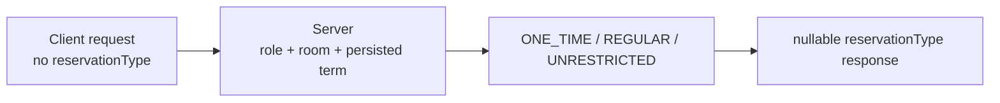

# 예약 정책 전환: 클라이언트 안내

서버는 실행 중 DB에 저장된 ReserveTerm의 네 시각을 예약 정책의 기준으로 삼습니다. 이 문서는 클라이언트가 따라야 할 API, 시간, 오류 계약을 정리합니다. 서버 내부 흐름은 [예약 로직 개요](reservation-logic-overview.md)를 참고하세요.

## 1. 요청과 응답



`POST /api/v2/reservation` 요청 구조는 바뀌지 않습니다. 요청에 `reservationType`을 넣지 않으며, 서버가 유형을 판정합니다.

```typescript
interface ReservationPostBody {
  roomId: number;
  startTime: string;
  endTime: string;
  recurringWeeks: number;
  title: string;
  contactEmail: string;
  contactPhone: string;
  professor: string;
  purpose: string;
  agreed: boolean;
}

type ReservationType = 'ONE_TIME' | 'REGULAR' | 'UNRESTRICTED';

interface Reservation {
  id: number;
  recurrenceId: string;
  startTime: string;
  endTime: string;
  recurringWeeks: number;
  reservationType: ReservationType | null;
  // Existing fields are unchanged.
}
```

`reservationType = null`은 V16 이전에 생성된 예약의 정상 상태입니다. 서버는 이를 `ONE_TIME`이나 `REGULAR`로 추론하지 않습니다. `/month`, `/week` 미리보기 DTO와 `/terms` DTO의 구조도 그대로입니다.

## 2. 저장된 term을 해석하는 방법

`GET /api/v2/reservation/terms`는 다음 조건을 만족하고 다른 유효한 term 구간과 겹치지 않는 행만 반환합니다.

네 시각은 실제 UTC components로 응답됩니다. 기본 일정의 09:00 `Asia/Seoul`은 `00:00Z`, KST 자정 경계는 전날 `15:00Z`이므로 `/terms` 값은 표준 UTC instant로 파싱한 뒤 사용자 timezone으로 표시합니다.

```text
applyStartTime < applyEndTime <= termEndTime
termStartTime < termEndTime
```

`applyStartTime`부터 `applyEndTime`까지의 신청 기간(application window)은 term 시작과 겹치거나 term 안에서 시작할 수 있지만, term 종료를 넘을 수는 없습니다. `termYear`와 `termType`은 API에 노출되지 않으며 권한 판정에도 쓰이지 않습니다. 운영자가 시각을 수정한 행이나 metadata가 `NULL/NULL`인 유효한 행도 응답에 포함될 수 있습니다.

응답 배열이 비어 있거나 선택한 날짜에 해당하는 term이 없을 수도 있습니다. 이때 클라이언트가 기본 일정으로 term을 만들어 대신하면 안 됩니다.

요청 시작 시각을 포함하는 행이 없으면 서버는 `Missing`일 때만 적용하는 2주 `ONE_TIME` 대체 규칙(Missing-only fallback)을 검사합니다. 반대로 해당 행이 조건을 어기거나 두 개 이상이면 `RESERVE-07`로 요청을 차단합니다(fail closed). `/terms`에 행이 없다는 이유만으로 클라이언트가 성공이나 실패를 미리 판단해서는 안 됩니다. 서버 응답을 최종 기준으로 사용하세요.

## 3. 역할별 UI 처리

| 역할/상태 | 서버 결과 | UI 권장 동작 |
|---|---|---|
| `ROLE_STAFF` | 모든 방에서 `UNRESTRICTED`, 기본 최대 20회 | 기존 `1..20` 반복 UI 유지 |
| Labmaster + 유효한 REGULAR phase | `REGULAR` | 마지막 예약 회차가 `termEndTime`을 넘지 않도록 선택지 제한 |
| Reservation role + 유효한 REGULAR phase | `RESERVE-04` | Labmaster 전용 안내 |
| Labmaster + 유효한 BEFORE phase | `RESERVE-08` | `applyStartTime` 기준 오픈 전 안내 |
| Reservation-only + 유효한 BEFORE phase | `RESERVE-04` | Labmaster 전용 안내 |
| 유효한 GAP phase | `RESERVE-14` | 신청 마감 안내 |
| 유효한 TERM_ACTIVE phase | `ONE_TIME` | 반복 횟수를 1로 제한 |
| 대상 term 없음 | 2주 오픈 시각 이후 `ONE_TIME` | 임의의 일정으로 term을 보충하지 않음 |
| 대상 term이 Invalid/Multiple | `RESERVE-07` | 운영 확인이 필요한 차단 상태 안내 |

Phase는 신청 기간을 먼저 확인합니다. Term이 활성 상태여도 `applyStartTime <= now < applyEndTime`이면 `REGULAR_APPLICATION`입니다. Term 안에서 신청 기간이 열리기 전과 닫힌 뒤에는 `TERM_ACTIVE`입니다.

Non-staff 예약은 각 회차가 `Asia/Seoul` 기준 같은 날짜 안에 끝나야 하며 3시간을 넘을 수 없습니다. 반복 예약의 시간은 회차별로 검사하며 합산하지 않습니다. Room ID 8은 `ROLE_PROFESSOR`가 추가로 필요하지만, professor 역할만으로 예약 생성 권한이 생기지는 않습니다.

`ONE_TIME` 예약은 요청 날짜 2주 전 09:00 `Asia/Seoul`에 열립니다. 그날이 토요일이나 일요일이면 다음 월요일 09:00로 미룹니다. 유효한 활성 term에서는 `termStartTime`보다 먼저 열리지 않으며, 공휴일은 따로 보정하지 않습니다.

## 4. 오류 코드

| Code | 의미 |
|---|---|
| `RESERVE-04` | Reservation-only 사용자가 유효한 BEFORE 또는 REGULAR phase에서 요청함 |
| `RESERVE-06` | Non-staff 회차가 KST 날짜 경계를 넘거나 3시간을 초과함 |
| `RESERVE-07` | 대상 행이 Invalid 또는 Multiple임 |
| `RESERVE-08` | Labmaster가 application 시작 전에 요청함 |
| `RESERVE-10` | 반복 횟수 정책 위반 |
| `RESERVE-11` | `ONE_TIME` 반복 요청 |
| `RESERVE-12` | 2주 `ONE_TIME` 오픈 전 요청 |
| `RESERVE-14` | 신청 기간 종료 후 term 시작 전 GAP에서 요청함 |

기존 room, permission, duration, overlap, past-time 오류 코드는 유지됩니다. 오류를 처리할 때는 HTTP status보다 code를 우선하세요. 알 수 없는 code만 서버 메시지나 기본 오류 처리로 넘깁니다.

## 5. 날짜·시각 해석

예약 요청과 응답 시각은 UTC instant입니다. 요청에는 `Z`를 붙인 ISO 8601 형식을 권장합니다. 기존 클라이언트와의 호환을 위해 offset 없는 `LocalDateTime` 형식도 허용되지만, 이 경우에도 숫자 구성요소를 UTC로 해석합니다.

```json
{
  "startTime": "2027-03-20T01:00:00Z",
  "endTime": "2027-03-20T02:00:00Z"
}
```

위 시각은 `2027-03-20 10:00`부터 `11:00 Asia/Seoul`까지의 예약입니다. 브라우저에서는 응답을 표준 instant로 파싱한 뒤 사용자 timezone으로 표시합니다.

예약 응답의 `startTime`, `endTime` 끝에 붙는 `Z`도 실제 UTC를 뜻합니다.

```text
server:  2027-03-20T01:00:00Z
screen:  2027-03-20 10:00 KST
```

`Z`를 제거하거나 `Asia/Seoul` wall-clock으로 다시 해석하는 예약 전용 parser를 사용하지 않습니다. 소수점 이하 초의 유무와 관계없이 표준 instant parser를 사용합니다.

`GET /api/v2/reservation/terms`의 네 시각도 실제 UTC입니다. 다만 기본 reserve term 일정은 `Asia/Seoul` 달력과 시각으로 정의한 뒤 UTC로 변환합니다. 예를 들어 `applyStartTime: "2027-02-01T00:00:00Z"`는 `2027-02-01 09:00 Asia/Seoul`입니다.

## 6. 완료 조건

- 예약 생성 요청에 `reservationType`이 없습니다.
- 상세 및 생성 응답에서 세 enum 값과 `null`을 모두 처리합니다.
- `/terms`의 빈 배열, 운영자가 수정한 시각, 누락된 대상 term을 안전하게 처리합니다.
- `REGULAR_APPLICATION` 구간은 `applyStartTime <= now < applyEndTime`입니다.
- 유효한 GAP과 `Missing` 대체 규칙을 다르게 안내합니다.
- 모든 Non-staff 요청은 각 회차가 KST 기준 같은 날 3시간 안에 끝나며, `ONE_TIME` 요청은 `recurringWeeks = 1`입니다.
- 예약과 `/terms` 응답을 실제 UTC instant로 파싱해 사용자 timezone으로 표시합니다.

클라이언트 소스 변경은 이 서버 작업 범위에 포함되지 않습니다.
