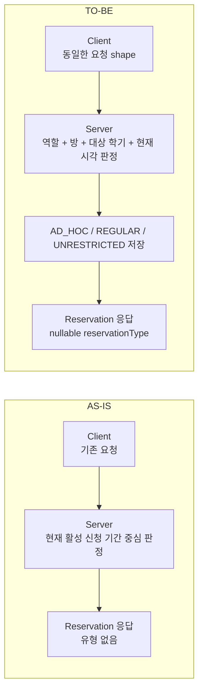

# 예약 정책 전환 — 클라이언트 작업 명세

이 문서는 서버의 예약 정책 변경을 클라이언트에 반영하기 위한 **AS-IS / TO-BE 작업 명세**입니다. 클라이언트 개발자는 이 문서만으로 변경 범위, API 계약, UI 동작, 오류 처리와 완료 조건을 확인할 수 있어야 합니다.

## 1. 비교 기준과 범위

| 구분 | 기준 |
|---|---|
| 서버 AS-IS | `origin/develop@d78ba7c` |
| 서버 TO-BE | `feat/reservation-policy@669ad86` |
| 클라이언트 분석 기준 | `wafflestudio/cse.snu.ac.kr main@bd1fd89` |
| 서버 API | `/api/v2/reservation/**` |
| 클라이언트 대상 | 예약 API type, 시간 변환, 예약 form, 학기 banner, 상세 modal, 오류 처리, 테스트 |

서버 내부 흐름은 [예약 로직 개요](reservation-logic-overview.md)를 참고합니다. 이 문서는 클라이언트 작업만 다루며 서버 구현, DB 운영, 공휴일 계산은 범위 밖입니다.

> **중요한 정정:** `origin/develop`의 `ReserveRequest`에는 원래부터 `reservationType`이 없으며, 현재 클라이언트의 `ReservationPostBody`에도 없습니다. 따라서 이번 작업은 “요청에서 `reservationType`을 제거하는 작업”이 아닙니다. 요청 shape은 유지하고, 서버가 판정한 유형을 **응답에서 새로 수용**하는 작업입니다.

## 2. 변경의 핵심



클라이언트는 예약 유형을 선택하거나 요청에 넣지 않습니다. 서버가 최종 판정자이며, 클라이언트의 사전 계산은 form 안내와 불필요한 실패를 줄이기 위한 UX 보조 수단입니다.

## 3. 서버 AS-IS / TO-BE

| 항목 | AS-IS — `origin/develop` | TO-BE — `feat/reservation-policy` | 클라이언트 영향 |
|---|---|---|---|
| 정책 기준 | 현재 활성화된 신청 기간과 DB term 행을 중심으로 분기 | 요청 시작일의 canonical 대상 학기와 현재 KST를 기준으로 분기 | 현재 시각만 보고 “정기/상시”를 표시하면 안 됨 |
| 예약 유형 | 별도 유형 없음 | `AD_HOC`, `REGULAR`, `UNRESTRICTED`를 서버가 판정·저장 | 상세 응답 type 추가 필요 |
| staff | term 정책 우회, 반복 상한 없음 | 모든 방에서 `UNRESTRICTED`, 반복 `1..20` 기본값 | 현재 반복 dropdown 상한과 일치 |
| labmaster 정기 예약 | 활성 신청 기간이면 첫 term을 사용 | 대상 학기의 `[applyStartTime, termStartTime)`에서만 `REGULAR` | 선택 날짜가 속한 term을 기준으로 안내 |
| reservation 역할 | 활성 신청 기간 밖에서는 반복 예약 가능할 수 있음 | 학기 시작 후 AD_HOC 오픈 시각부터 1회만 가능 | 일반 예약 권한의 반복 UI 제거 |
| 수시 예약 오픈 | 겹치는 term과 마지막 term 종료 시각에 의존 | 예약 시작일 2주 전 09:00 KST, 주말이면 다음 월요일 09:00 | 오픈 전 오류 안내 추가 |
| 비 staff 예약 시간 | 활성 정기 신청 기간에만 3시간 제한 | 모든 비 staff 회차가 같은 KST 날짜이며 3시간 이하 | 종료 시각 option 제한 필요 |
| 반복 값 검증 | 명시적 양수·상한 검증 없음 | 양수 필수, AD_HOC 1회, REGULAR는 term 끝까지, staff는 설정 상한 | 역할·시점에 맞는 option 제공 |
| 학기 데이터 | `/terms`가 DB 전체 행 반환 | canonical 검증을 통과한 행만 반환 | 빈 배열과 누락 term을 정상적인 fail-closed 상태로 처리 |
| 신청 종료 | DB 입력값 사용 | `applyEndTime = termStartTime` | banner 경계를 `[start, end)`로 판정 |
| 동시성 | room lock 후 충돌 검사 | room lock을 사용자 조회보다 먼저 잡고 `saveAll`까지 유지 | API 사용법 변화 없음, 409 처리 유지 |
| legacy 예약 | 유형 필드 없음 | V16 이전 행은 `reservationType = null` | `null`을 추론하지 말고 미분류로 처리 |
| 오류 | `RESERVE-01..09` | `RESERVE-08` 의미 변경, `RESERVE-10..17` 추가 | status 중심 fallback에서 code 중심 처리로 변경 |

## 4. API 계약

### 4.1 예약 생성 요청 — shape 변경 없음

`POST /api/v2/reservation`은 AS-IS와 TO-BE가 동일합니다.

```typescript
interface ReservationPostBody {
  roomId: number;
  startTime: string;
  endTime: string;
  recurringWeeks: number;
  title: string;
  contactEmail: string;
  contactPhone: string;
  professor: string;
  purpose: string;
  agreed: boolean;
}
```

`reservationType`을 추가하면 안 됩니다. 서버는 요청에 오래된 `reservationType` 필드가 들어와도 현재 Jackson 설정에 따라 무시하지만, 이 동작을 새 클라이언트 계약으로 사용하지 않습니다.

요청 시간은 offset 없는 KST wall-clock 구성요소로 전송합니다.

```json
{
  "startTime": "2027-03-20T10:00:00",
  "endTime": "2027-03-20T11:00:00"
}
```

현재 클라이언트의 `Date.toISOString()` 결과처럼 `Z`가 붙은 UTC instant를 보내지 않습니다.

```json
{
  "startTime": "2027-03-20T01:00:00.000Z"
}
```

위 값은 10:00 KST의 숫자 구성요소를 01:00으로 바꾸므로 TO-BE 요청 형식이 아닙니다.

### 4.2 예약 응답 — `reservationType` 추가

`POST /api/v2/reservation`은 `Reservation[]`, `GET /api/v2/reservation/{reservationId}`는 `Reservation`을 반환합니다. TO-BE의 정확한 응답 type은 다음과 같습니다.

```typescript
type ReservationType = 'AD_HOC' | 'REGULAR' | 'UNRESTRICTED';

interface Reservation {
  id: number;
  recurrenceId: string; // UUID
  title: string;
  purpose: string;
  startTime: string;
  endTime: string;
  recurringWeeks: number;
  reservationType: ReservationType | null;
  roomName: string | null;
  roomLocation: string;
  userName: string | null;
  contactEmail: string | null;
  contactPhone: string | null;
  professor: string;
}
```

`purpose`는 서버 응답에서 non-null이므로 현재 클라이언트의 optional 선언을 required로 맞춥니다. Staff 상세 응답과 생성 응답에는 사용자명·연락처가 포함되며, non-staff 상세 응답에서는 `userName`, `contactEmail`, `contactPhone`이 `null`입니다.

`startTime`과 `endTime`은 ISO_INSTANT 형태의 trailing `Z` 문자열입니다. 나노초 값에 따라 fractional seconds가 포함될 수 있으므로 정규식이나 parser가 `2027-03-20T10:00:00Z`와 `2027-03-20T10:00:00.123Z`를 모두 받아야 합니다.

| 값 | 의미 | 표시 권장값 |
|---|---|---|
| `AD_HOC` | 학기 시작 후 예약별 오픈 시각에 생성된 1회 수시 예약 | 수시 예약 |
| `REGULAR` | labmaster가 대상 학기 신청 창에 생성한 정기 예약 | 정기 예약 |
| `UNRESTRICTED` | staff가 방·학기 제한 없이 생성한 예약 | 스태프 예약 |
| `null` | V16 이전 legacy 예약 | 미분류 예약 |

`null`을 `AD_HOC` 또는 `REGULAR`로 추론하지 않습니다. 정상 TO-BE 응답에는 필드가 항상 존재하지만 rollout 중 서버 rollback에 대비해 wire decoder는 누락된 `undefined`를 임시로 `null`로 normalize합니다.

```typescript
type ReservationWire = Omit<Reservation, 'reservationType'> & {
  reservationType?: ReservationType | null;
};

const normalizeReservation = (value: ReservationWire): Reservation => ({
  ...value,
  reservationType: value.reservationType ?? null,
});
```

`GET /month`와 `GET /week`의 `ReservationPreview`에는 `reservationType`이 추가되지 않습니다.

### 4.3 학기 응답 — shape은 같고 의미가 변경됨

`GET /api/v2/reservation/terms`의 type은 변경되지 않습니다.

```typescript
interface ReserveTerm {
  id: number;
  applyStartTime: string;
  applyEndTime: string;
  termStartTime: string;
  termEndTime: string;
}
```

TO-BE에서는 canonical 검증을 통과한 term만 반환합니다.

- `applyStartTime <= now < applyEndTime`이 신청 창입니다.
- `applyEndTime`은 `termStartTime`과 같습니다.
- 잘못되거나 충돌하는 term은 응답에서 제외됩니다.
- 배열이 비어 있거나 선택 날짜의 term이 없을 수 있습니다.
- 클라이언트는 누락 term을 임의로 생성하거나 다른 term으로 대체하지 않습니다.

## 5. 서버 정책과 UI 기대 동작

서버 판정이 최종 기준입니다. 아래 UI 동작은 사용자가 실패 이유를 미리 이해하도록 돕는 범위에서 적용합니다.

| 역할 | 방·시점 | 서버 결과 | 클라이언트 기대 동작 |
|---|---|---|---|
| `ROLE_STAFF` | 모든 방, 미래 시각 | `UNRESTRICTED` | 반복 `1..20` 제공, term banner에 의해 제한하지 않음 |
| `ROLE_LABMASTER` | 세미나실, 신청 시작 전 | `RESERVE-08` | matching term이 있으면 시작 시각, 없으면 일반적인 오픈 전 안내 |
| `ROLE_LABMASTER` | 세미나실, `[applyStartTime, termStartTime)` | `REGULAR` | 해당 term 끝을 넘지 않는 반복 option 제공 |
| `ROLE_RESERVATION` | 세미나실, 대상 학기 시작 전 | `RESERVE-04` | 정기 신청은 labmaster 전용임을 안내 |
| `ROLE_LABMASTER` 또는 `ROLE_RESERVATION` | 학기 시작 후, 예약별 오픈 전 | `RESERVE-12` | 수시 예약 오픈 전임을 안내 |
| `ROLE_LABMASTER` 또는 `ROLE_RESERVATION` | 학기 시작 후, 예약별 오픈 이후 | `AD_HOC` | 반복을 1회로 고정 |
| 모든 비 staff | 세미나실이 아닌 방 | `RESERVE-02` | 예약 button을 노출하지 않거나 명확한 권한 안내 |
| 비 staff + room ID 8 | `ROLE_PROFESSOR` 없음 | `RESERVE-03` | 교수회의실 추가 권한 안내 |

추가 규칙은 다음과 같습니다.

- 생성 endpoint 진입 역할은 `STAFF`, `LABMASTER`, `RESERVATION`입니다.
- `ROLE_PROFESSOR`는 room ID 8의 추가 gate일 뿐 생성 역할이 아닙니다.
- 비 staff 예약은 각 회차가 같은 KST 날짜 안에 있고 3시간 이하여야 합니다.
- AD_HOC 오픈 시각은 예약 시작일 2주 전 09:00 KST입니다.
- 오픈일이 토요일 또는 일요일이면 다음 월요일 09:00로 이동합니다.
- 공휴일은 보정하지 않습니다.
- 다른 학기의 신청 창이 열려 있어도 선택한 예약 날짜의 대상 학기 판정을 바꾸지 않습니다.

## 6. 현재 클라이언트 AS-IS

분석 기준 `main@bd1fd89`의 현재 상태입니다.

| 파일 | AS-IS | 문제 |
|---|---|---|
| `app/types/api/v2/reservation/index.ts` | 요청 type은 올바르지만 응답 `Reservation`에 `reservationType` 없음 | TO-BE 상세 응답을 표현하지 못함 |
| `app/routes/{-$locale}/reservations/hooks/useReservationForm.ts` | `toISOString()`으로 요청 시간 생성 | KST wall-clock 숫자 구성요소가 UTC로 이동함 |
| 같은 hook | 반복 option을 항상 `1..20` 제공 | staff에는 일치하지만 AD_HOC 1회와 REGULAR term 경계를 구분하지 못함 |
| 같은 hook | status별 fallback과 server message 우선 처리 | 새 error code별 다국어 UX를 제어하기 어려움 |
| `ReserveTermBanner.tsx` | “정기 기간 외에는 누구나 예약” 문구 사용 | 역할·AD_HOC 오픈·1회 제한을 반영하지 못함 |
| 같은 banner | `isAfter(applyStartTime)` 사용 | 정확히 신청 시작 시각인 하한 경계를 제외함 |
| 같은 banner | room ID 8이면 무조건 숨김 | professor gate를 통과한 non-staff 정책 안내가 사라짐 |
| `kstDayjs.ts`와 예약 화면 | trailing `Z`를 실제 UTC instant로 변환 | 10:00 응답이 19:00 KST로 표시될 수 있음 |
| `app/store.ts` | `Role` union에 `ROLE_PROFESSOR` 없음 | room ID 8 UX 판정에 필요한 역할을 type으로 표현하지 못함 |
| 예약 Playwright | staff 1회·2회 생성/삭제 중심 | 새 역할·학기·시간·오류 경계를 검증하지 못함 |

## 7. TO-BE 클라이언트 작업

### 7.1 P0 — 요청·응답 시간 adapter 분리

전역 `kstDayjs`의 의미를 바꾸지 않습니다. 다른 API의 실제 instant까지 영향을 받을 수 있기 때문입니다. 예약 API 전용 adapter를 `app/utils/reservation.ts` 또는 별도 예약 util에 둡니다.

#### 요청 formatter

선택한 KST 날짜와 `HH:mm`을 숫자 구성요소 그대로 조합합니다.

```typescript
const formatReservationRequestDateTime = (date: Date, time: string) =>
  `${kstDayjs(date).format('YYYY-MM-DD')}T${time}:00`;
```

`useReservationForm.ts`에서 두 번의 `toISOString()` 호출을 이 formatter로 교체합니다.

#### 응답 parser

예약 API 응답의 trailing `Z`를 instant로 변환하지 않고 숫자 구성요소만 KST wall-clock으로 해석합니다.

```typescript
const parseReservationResponseDateTime = (value: string) =>
  dayjs.tz(value.replace(/Z$/, ''), 'Asia/Seoul');
```

다음 예약 화면의 응답 시각 파싱을 새 adapter로 교체합니다.

- `CalendarColumn.tsx`
- `CalendarContent.tsx`
- `ReservationDetailModal.tsx`
- `ReserveTermBanner.tsx`

예상 결과는 다음과 같습니다.

```text
server value: 2027-03-20T10:00:00Z
screen:       2027-03-20 10:00 KST
must not be:  2027-03-20 19:00 KST
```

이 trailing `Z` 동작은 이번 서버 diff에서 새로 생긴 것은 아니지만, 현재 클라이언트 구현과 서버의 `LocalDateTime` 계약이 맞지 않으므로 이번 전환의 P0 호환 작업에 포함합니다.

### 7.2 P0 — API type과 role type 갱신

`app/types/api/v2/reservation/index.ts`에 `ReservationType`과 nullable 응답 필드를 추가합니다.

```typescript
export type ReservationType = 'AD_HOC' | 'REGULAR' | 'UNRESTRICTED';

export interface Reservation {
  // existing fields...
  reservationType: ReservationType | null;
}
```

- `ReservationPostBody`는 변경하지 않습니다.
- `ReservationPreview`는 변경하지 않습니다.
- `ReserveTerm`은 field를 추가하지 않습니다.
- `ReservationWire`를 target `Reservation`으로 normalize하여 서버 rollback 중 field 누락에도 화면이 깨지지 않게 합니다.
- `api.ts`에 `fetchReservation()`을 두고 상세 응답을 normalize한 뒤 `ReservationDetailModal`이 사용하도록 합니다. 현재 modal 내부의 직접 `fetch`는 제거합니다.
- 현재 생성 성공 흐름은 response body를 사용하지 않으므로 `postReservation()`의 `Reservation[]` 반환은 필수 작업이 아닙니다. 생성 결과를 즉시 표시하는 UX를 추가할 때만 parse합니다.
- `app/store.ts`의 `Role`에 `ROLE_PROFESSOR`를 추가합니다.

### 7.3 P0 — 오류 code 중심 처리

현재의 `serverMessage` 우선 처리를 `code` 우선 처리로 변경합니다. 서버 message는 알 수 없는 code의 fallback으로만 사용합니다. `CserealException` 응답 body는 다음 shape입니다.

```typescript
interface ReservationErrorBody {
  code: string | null;
  message: string | null;
}
```

| Code | Status | 의미 | 클라이언트 처리 |
|---|---:|---|---|
| `RESERVE-01` | 404 | 방 없음 | 방 정보를 새로고침하도록 안내 |
| `RESERVE-02` | 403 | 비 staff의 비세미나실 예약 | 세미나실 또는 권한 확인 안내 |
| `RESERVE-03` | 403 | 교수회의실 권한 없음 | `ROLE_PROFESSOR` 또는 staff 필요 안내 |
| `RESERVE-04` | 403 | 정기 신청은 labmaster 전용 | 역할 안내 |
| `RESERVE-05` | 400 | 정기 회차가 학기 범위를 벗어남 | 방어 경로: 일반 invalid-period 안내 |
| `RESERVE-06` | 400 | 비 staff의 날짜·3시간 제한 위반 | 같은 날짜, 최대 3시간 안내 |
| `RESERVE-07` | 403 | canonical term 미등록·불일치 | 일시적으로 정기 예약 불가 안내 |
| `RESERVE-08` | 403 | 정기 신청 시작 전 | matching `/terms` 행이 있으면 `applyStartTime`, 없으면 일반 안내 |
| `RESERVE-09` | 409 | 기존 예약과 시간 충돌 | 기존 충돌 안내 유지 |
| `RESERVE-10` | 400 | 반복 횟수 정책 위반 | 허용 범위 재선택 안내 |
| `RESERVE-11` | 400 | AD_HOC 반복 요청 | 1회로 변경 안내 |
| `RESERVE-12` | 403 | AD_HOC 오픈 전 | 예약별 오픈 전임을 안내 |
| `RESERVE-13` | 400 | 현재 또는 과거 시작 시각 | 미래 시각 재선택 안내 |
| `RESERVE-15` | 400 | `startTime >= endTime` | 종료 시각 재선택 안내 |
| `RESERVE-16` | 403 | service-level 생성 권한 없음 | 로그인·역할 갱신 안내 |
| `RESERVE-17` | 400 | 지원하지 않는 날짜 범위 | 유효한 날짜 재선택 안내 |

`RESERVE-05`는 현재 정상 REGULAR 흐름에서 반복 상한을 먼저 검사하므로 일반적으로 `RESERVE-10`이 선행하며, loop 내부 invariant를 지키는 방어 코드에 가깝습니다. `RESERVE-14`는 서버 enum에 정의되어 있지만 현재 TO-BE 생성 경로에서는 사용하지 않습니다. 두 code 모두 화면을 깨뜨리지 않는 fallback을 제공하되 주요 사용자 흐름으로 전제하지 않습니다.

### 7.4 P1 — 반복·시간 form을 정책에 맞게 제한

현재 route loader의 `reserveTerms`는 `ReservationCalendar`까지만 전달되고 form 경로에는 도달하지 않습니다. 별도 API 요청을 추가하지 말고 이미 받은 값을 다음 순서로 전달합니다.

```text
$roomType/$roomName.tsx loader
  -> ReservationCalendar reserveTerms
  -> CalendarToolbar reserveTerms
  -> AddReservationModal reserveTerms
  -> useReservationForm({ roomId, reserveTerms, onSuccess })
```

따라서 `ReservationCalendar/index.tsx`와 `CalendarToolbar.tsx`의 props도 변경 대상입니다. 비세미나실에서는 기존처럼 `reserveTerms = null`이며 staff form은 term 없이 동작합니다.

#### 반복 option

1. `ROLE_STAFF`: 현재 dropdown과 동일한 `1..20`
2. `ROLE_LABMASTER`이고 선택한 시작 시각의 target term이 현재 신청 창인 경우: 첫 회차 `endTime`부터 `termEndTime`까지 들어가는 최대 주차
3. 그 외 non-staff: `1`만 제공

신청 창 판정은 반드시 하한 포함, 상한 제외입니다.

```text
applyStartTime <= now < applyEndTime
```

반복 횟수는 UX 보조값이며 서버 응답이 최종 기준입니다. 서버의 staff 상한 설정은 현재 API로 노출되지 않으므로 클라이언트는 현재 dropdown과 동일한 배포 기준 기본값 `20`을 사용합니다. 서버 설정을 바꿀 때 함께 갱신해야 한다는 운영 의존성을 코드 상수 근처에 기록합니다.

#### 종료 시각 option

비 staff는 선택한 시작 시각 기준 3시간을 넘는 종료 option을 제공하지 않습니다. 현재 form이 날짜를 하나만 선택하므로 같은 날짜 조건도 자연스럽게 유지합니다. staff의 기존 시간 option은 유지합니다.

#### 제출 가능 여부

클라이언트가 서버 정책 전체를 복제해 예약 유형을 판정하지 않습니다. 다음처럼 명확한 경우만 사전 차단합니다.

- `ROLE_RESERVATION`이 응답에 존재하는 target term의 시작 전 예약을 시도함
- labmaster가 응답에 존재하는 target term의 신청 시작 전에 예약을 시도함
- 비 staff가 3시간 또는 반복 제한을 위반함

term이 누락되어 `applyStartTime`이나 `termStartTime`을 알 수 없거나 서버와 시각 경계가 다를 수 있으면 요청을 허용하고 error code를 표시합니다. 특히 `RESERVE-08`인데 matching `/terms` 행이 없으면 구체적인 신청 시작 시각을 만들지 않고 일반적인 “정기 신청 시작 전” 안내를 사용합니다.

### 7.5 P1 — 학기 banner 문구와 경계 수정

`ReserveTermBanner.tsx`를 다음과 같이 변경합니다.

- “정기예약 기간 외에는 누구나 예약 가능” 문구 제거
- labmaster 정기 예약과 권한 보유자의 1회 AD_HOC 정책을 구분해 설명
- 신청 창을 `applyStartTime <= now < applyEndTime`으로 계산
- 선택 날짜가 속한 target term을 우선 표시
- `applyEndTime = termStartTime`을 기준으로 마감 표시
- 빈 term 배열은 오류가 아니라 “등록된 정기 예약 일정 없음” 상태로 표시
- room ID 8을 무조건 숨기지 않고 professor 추가 권한이 필요하다는 안내 제공
- 모든 term 시각은 예약 전용 component-preserving parser 사용

서버가 invalid term을 숨기므로 클라이언트는 응답에 없는 term을 만들어 banner에 표시하지 않습니다.

### 7.6 P1 — 예약 상세에 유형 표시

`ReservationDetailModal.tsx`에 예약 유형 행을 추가합니다.

| API 값 | 화면 표시 |
|---|---|
| `AD_HOC` | 수시 예약 |
| `REGULAR` | 정기 예약 |
| `UNRESTRICTED` | 스태프 예약 |
| `null` | 미분류 예약 |

`null`인 legacy 예약도 상세 조회와 삭제가 정상 동작해야 합니다. 유형에 따라 삭제 button을 제한하지 않습니다.

## 8. 파일별 변경 목록

| 파일 | 필수 변경 |
|---|---|
| `app/types/api/v2/reservation/index.ts` | `ReservationType`, nullable `reservationType` 추가 |
| `app/store.ts` | `ROLE_PROFESSOR` role type 추가 |
| `app/utils/reservation.ts` 또는 새 예약 util | 요청 formatter, 응답 component-preserving parser 추가 |
| `app/routes/{-$locale}/reservations/api.ts` | `ReservationErrorBody`, 상세 `fetchReservation()`과 wire normalize, code/message fallback |
| `app/routes/{-$locale}/reservations/components/ReservationCalendar/index.tsx` | 기존 `reserveTerms`를 toolbar로 전달 |
| `app/routes/{-$locale}/reservations/components/ReservationCalendar/CalendarToolbar.tsx` | `reserveTerms`를 modal로 전달 |
| `app/routes/{-$locale}/reservations/hooks/useReservationForm.ts` | `reserveTerms` 입력, `toISOString()` 제거, 역할·term 기반 반복 option, code 기반 오류 처리 |
| `app/routes/{-$locale}/reservations/components/ReservationCalendar/AddReservationModal.tsx` | `reserveTerms` 전달, 동적 반복 option과 정책 안내 표시 |
| `app/routes/{-$locale}/reservations/components/ReservationCalendar/ReserveTermBanner.tsx` | 문구, 경계, target term, room ID 8, 시간 parser 수정 |
| `app/routes/{-$locale}/reservations/components/ReservationCalendar/CalendarColumn.tsx` | 예약 응답 시간 parser 교체 |
| `app/routes/{-$locale}/reservations/components/ReservationCalendar/CalendarContent.tsx` | 날짜별 예약 분류 parser 교체 |
| `app/routes/{-$locale}/reservations/components/ReservationCalendar/ReservationDetailModal.tsx` | 시간 parser 교체, nullable 예약 유형 표시 |
| `app/utils/reservation.test.ts` 또는 동일 역할 test | 고정 `now` 기반 policy·시간 adapter unit test |
| `tests/reservations/room/flow.spec.ts` | TO-BE backend로 staff·반복 생성/삭제 회귀 검증 |

## 9. 완료 조건

### 9.1 계약 테스트

- [ ] `ReservationPostBody`에 `reservationType`이 없다.
- [ ] 요청 `2027-03-20 10:00 KST`가 `2027-03-20T10:00:00`으로 전송된다.
- [ ] 요청 시간에 `Z` 또는 offset이 붙지 않는다.
- [ ] 응답 `2027-03-20T10:00:00Z`와 fractional seconds가 있는 값이 모두 `10:00 KST`로 표시된다.
- [ ] `Reservation`의 전체 field와 nullability가 서버 `ReservationDto`와 일치하고 `purpose`가 required다.
- [ ] `Reservation.reservationType`이 세 enum 값과 `null`을 모두 처리한다.
- [ ] rollout 중 누락된 `reservationType`은 wire decoder에서 `null`로 normalize된다.
- [ ] `ReservationPreview`와 `ReserveTerm`의 기존 shape은 유지된다.

### 9.2 UI 동작 테스트

- [ ] staff 반복 option은 현재와 동일하게 `1..20`이다.
- [ ] labmaster의 정기 신청 창 하한 `applyStartTime`이 포함된다.
- [ ] `applyEndTime`에서는 정기 신청 상태가 종료된다.
- [ ] labmaster 정기 반복은 마지막 회차가 `termEndTime`을 넘지 않는다.
- [ ] 일반 예약 권한의 AD_HOC 반복 option은 1회뿐이다.
- [ ] 비 staff 종료 시각은 시작 후 3시간을 넘지 않는다.
- [ ] room ID 8에서 professor 추가 권한 안내가 노출된다.
- [ ] 빈 `/terms` 응답에서 화면이 깨지지 않는다.
- [ ] legacy `reservationType = null` 상세와 삭제가 정상 동작한다.

### 9.3 오류 처리 테스트

`RESERVE-01..17`을 table-driven test로 검증합니다.

- [ ] 매핑 표의 각 활성 code가 의도한 다국어 message key로 연결된다.
- [ ] `RESERVE-08`은 “다른 신청 기간 종료 대기”가 아니라 “대상 학기 신청 시작 전”으로 표시된다.
- [ ] matching term이 없는 `RESERVE-08`은 임의의 시작 시각을 표시하지 않는다.
- [ ] `RESERVE-05`와 미사용 `RESERVE-14`는 방어·fallback 경로로 처리된다.
- [ ] `RESERVE-09` 충돌 처리가 유지된다.
- [ ] 알 수 없는 code는 server message 또는 일반 오류로 fallback한다.
- [ ] JSON이 아닌 method-security 오류 응답도 일반 오류로 안전하게 처리한다.

### 9.4 결정적 테스트 전략

브라우저 clock만 고정하면 실제 backend clock과 어긋나므로 신청 시작·종료 경계를 real-server E2E로 검증하지 않습니다. 시간·역할·term 판정을 side effect 없는 helper로 추출하고 `now`를 인자로 주입합니다.

```typescript
getReservationFormPolicy({ roles, reserveTerms, now, startTime, endTime });
```

고정된 `now`와 fixture term으로 다음을 테스트합니다.

- `now === applyStartTime`: REGULAR window 포함
- `now === applyEndTime`: REGULAR window 제외
- target term 누락: hard block하지 않고 server error에 위임
- staff: `1..20`
- labmaster REGULAR: term 끝까지 계산
- reservation/labmaster AD_HOC: 1회
- 응답 시각 component 보존과 요청 offset 제거

현재 저장소에 별도 unit test script가 없으므로 Node test runner와 기존 `tsx`를 사용하는 최소 구성을 권장합니다.

```bash
TZ=Asia/Seoul pnpm exec tsx --test app/utils/reservation.test.ts
pnpm typecheck
pnpm lint
pnpm build
```

기존 staff 생성·삭제 E2E는 반드시 TO-BE backend checkout을 지정해 실행합니다. backend image가 JAR를 복사하므로 먼저 build합니다.

```bash
(cd /path/to/csereal-server && ./gradlew bootJar)
BACKEND_DIR=/path/to/csereal-server pnpm test tests/reservations/room/flow.spec.ts
```

`BACKEND_DIR`를 생략하면 기본값 `../csereal-server-main`이 사용되어 TO-BE가 아닌 baseline backend를 검증할 수 있으므로 이번 작업의 evidence로 인정하지 않습니다. Non-staff REGULAR/AD_HOC server 경계는 서버의 고정 `Clock` 테스트가 이미 담당하며, 클라이언트 E2E를 추가한다면 실제 server KST를 기준으로 canonical term을 seed해야 합니다.

## 10. Rollout

권장 순서는 **서버 배포 후 클라이언트 배포**입니다.

1. 서버 V16 적용과 current/next canonical term을 확인합니다.
2. TO-BE 서버를 배포합니다.
3. `/terms`, 단일 예약 상세, 예약 생성 오류 code를 smoke test합니다.
4. 클라이언트를 배포합니다.
5. 10:00 예약이 10:00에 표시되는지, staff 20회와 non-staff 1회 제한이 맞는지 확인합니다.

서버와 클라이언트 사이의 임시 호환 상태는 다음과 같습니다.

- 요청 shape은 바뀌지 않아 기존 클라이언트도 POST할 수 있습니다.
- 새 `reservationType` 응답 필드는 additive이므로 기존 클라이언트가 무시할 수 있습니다.
- 기존 클라이언트의 반복 `1..20`은 staff 상한과 일치하지만, non-staff에는 정책과 맞지 않는 `2..20`을 계속 노출할 수 있습니다.
- 기존 banner 문구와 시간 변환은 TO-BE 정책을 정확히 설명하지 못합니다.
- legacy 예약의 `reservationType = null`은 정상 상태이므로 migration 직후에도 오류로 취급하지 않습니다.

### Rollback

새 클라이언트 배포 후 서버만 AS-IS로 rollback하면 상세 응답에서 `reservationType`이 누락되고 `/terms`가 검증되지 않은 행까지 반환합니다.

- wire decoder의 `undefined -> null` normalize로 상세 화면 crash는 방지합니다.
- offset 없는 요청 형식은 AS-IS `LocalDateTime` 요청과도 호환됩니다.
- 그러나 AS-IS `/terms`는 canonical 검증 보장이 없으므로 새 banner·form 안내의 정확성은 보장할 수 없습니다.

따라서 전체 rollback이 필요하면 **클라이언트를 먼저 이전 버전으로 되돌린 후 서버를 rollback**합니다. 서버만 rollback한 상태를 장기간 운영하지 않습니다. 서버 rollback 가능 기간이 끝난 뒤에만 `ReservationWire.reservationType?`의 optional fallback 제거를 검토합니다.

## 11. 관련 문서

- 서버 전체 흐름: [예약 로직 개요](reservation-logic-overview.md)
- term 장애 대응: [정기 예약 구간 복구 Runbook](reserve-term-recovery-runbook.md)
- 핵심 서버 정책: [`ReservationService.kt`](../src/main/kotlin/com/wafflestudio/csereal/core/reservation/service/ReservationService.kt)
- canonical 학기 계산: [`ReserveTermPolicy.kt`](../src/main/kotlin/com/wafflestudio/csereal/core/reservation/service/ReserveTermPolicy.kt)
