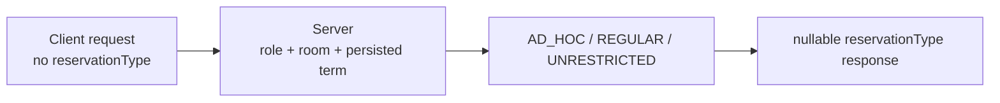

# 예약 정책 전환 — 클라이언트 안내

서버 runtime은 DB에 저장된 ReserveTerm 네 시각을 source of truth로 사용합니다. 이 문서는 클라이언트가 지켜야 하는 API, 시간, 오류 계약을 설명합니다. 서버 내부 흐름은 [예약 로직 개요](reservation-logic-overview.md)를 참고합니다.

## 1. 요청과 응답



`POST /api/v2/reservation` 요청 shape은 변경되지 않으며 `reservationType`을 넣지 않습니다. 서버가 유형을 판정합니다.

```typescript
interface ReservationPostBody {
  roomId: number;
  startTime: string;
  endTime: string;
  recurringWeeks: number;
  title: string;
  contactEmail: string;
  contactPhone: string;
  professor: string;
  purpose: string;
  agreed: boolean;
}

type ReservationType = 'AD_HOC' | 'REGULAR' | 'UNRESTRICTED';

interface Reservation {
  id: number;
  recurrenceId: string;
  startTime: string;
  endTime: string;
  recurringWeeks: number;
  reservationType: ReservationType | null;
  // Existing fields are unchanged.
}
```

`reservationType = null`은 V16 이전 legacy 예약의 정상 상태입니다. `AD_HOC`이나 `REGULAR`로 추론하지 않습니다. `/month`와 `/week` preview DTO, `/terms` DTO shape도 변경되지 않습니다.

## 2. Persisted term의 클라이언트 의미

`GET /api/v2/reservation/terms`는 다음 schedule invariant를 만족하고 다른 valid term window와 겹치지 않는 행만 반환합니다.

```text
applyStartTime < applyEndTime <= termStartTime < termEndTime
```

`termYear`/`termType` metadata는 API에 노출되지 않으며 runtime authorization 기준이 아닙니다. Operator가 수정한 custom persisted time과 metadata가 `NULL/NULL`인 valid row도 응답될 수 있습니다. 배열이 비거나 선택 날짜의 term이 없을 수 있으며, 클라이언트가 default calendar로 term을 만들어 대체하면 안 됩니다.

요청 시작 시각을 포함하는 persisted row가 없을 때 서버는 **Missing-only fallback**으로 2주 one-off `AD_HOC`을 검사합니다. 반대로 포함하는 행이 malformed이거나 여러 개이면 `RESERVE-07`로 fail closed합니다. 따라서 `/terms`에 행이 없다는 이유만으로 클라이언트가 성공/실패를 확정하지 말고 서버 응답을 최종 기준으로 사용합니다.

## 3. 역할과 UI 힌트

| 역할/상태 | 서버 결과 | UI 권장 동작 |
|---|---|---|
| `ROLE_STAFF` | 모든 방에서 `UNRESTRICTED`, 기본 최대 20회 | 기존 `1..20` 반복 UI 유지 |
| Labmaster + valid REGULAR phase | `REGULAR` | 마지막 occurrence가 `termEndTime`을 넘지 않게 선택지 제한 |
| Reservation role + valid REGULAR phase | `RESERVE-04` | labmaster 전용 안내 |
| Labmaster + valid BEFORE phase | `RESERVE-08` | persisted `applyStartTime` 기준 오픈 전 안내 |
| Reservation-only + valid BEFORE phase | `RESERVE-04` | labmaster 전용 안내 |
| Valid GAP phase | `RESERVE-14` | 신청 마감 안내 |
| Valid TERM_ACTIVE phase | one-off `AD_HOC` | 반복을 1로 제한 |
| Missing target | 2주 opening 이후 one-off `AD_HOC` | term 누락을 임의 schedule로 보충하지 않음 |
| Invalid/Multiple target | `RESERVE-07` | 운영 확인이 필요한 fail-closed 상태 안내 |

Non-staff는 각 occurrence가 같은 KST 날짜이고 3시간 이하여야 합니다. Room ID 8에는 `ROLE_PROFESSOR`가 추가로 필요하지만 professor 역할만으로 생성 권한이 생기지는 않습니다.

AD_HOC opening은 요청 날짜 2주 전의 09:00 `Asia/Seoul`이며 토·일요일이면 다음 월요일 09:00로 이동합니다. Valid active term에서는 `termStartTime`보다 먼저 열리지 않습니다. 공휴일은 보정하지 않습니다.

## 4. 오류 code

| Code | 의미 |
|---|---|
| `RESERVE-04` | Reservation-only 사용자의 valid BEFORE 또는 REGULAR phase는 labmaster 전용 |
| `RESERVE-07` | Target row가 invalid 또는 multiple |
| `RESERVE-08` | Labmaster의 persisted application 시작 전 |
| `RESERVE-10` | 반복 횟수 정책 위반 |
| `RESERVE-11` | AD_HOC 반복 요청 |
| `RESERVE-12` | 2주 AD_HOC opening 전 |
| `RESERVE-14` | Persisted application 종료 후 term 시작 전 GAP |

기존 room, permission, duration, overlap, past-time 오류 code는 유지됩니다. Error handling은 HTTP status보다 code를 우선하고, 알 수 없는 code만 server message/general fallback으로 처리합니다.

## 5. component-preserving 시간 처리

요청은 offset 없는 KST wall-clock 구성요소로 전송합니다.

```json
{
  "startTime": "2027-03-20T10:00:00",
  "endTime": "2027-03-20T11:00:00"
}
```

`Date.toISOString()`으로 `2027-03-20T01:00:00Z`를 보내면 숫자 구성요소가 바뀌므로 계약과 다릅니다.

응답은 기존 global serializer 동작 때문에 **구성요소를 유지한 채 trailing `Z`가 붙습니다**. 이는 실제 UTC instant가 아닙니다.

```text
server:  2027-03-20T10:00:00Z
screen:  2027-03-20 10:00 KST
wrong:   2027-03-20 19:00 KST
```

Fractional seconds 유무를 모두 허용하고, 예약 전용 parser에서 끝의 `Z`를 제거한 뒤 `Asia/Seoul` wall-clock으로 해석합니다. 전역 instant parser의 의미는 바꾸지 않습니다.

## 6. 완료 조건

- 요청 type에 `reservationType`이 없습니다.
- 상세/생성 응답은 세 enum과 `null`을 처리합니다.
- `/terms`의 빈 배열, custom time, 누락 target을 안전하게 처리합니다.
- REGULAR window는 `applyStartTime <= now < applyEndTime`입니다.
- Valid GAP과 Missing-only fallback을 서로 다르게 안내합니다.
- Non-staff AD_HOC 반복은 1회이고 시간은 같은 날 최대 3시간입니다.
- 응답 `10:00:00Z`가 화면에서 10:00 KST로 보입니다.

이 서버 작업에는 client source 변경이 포함되지 않습니다.
