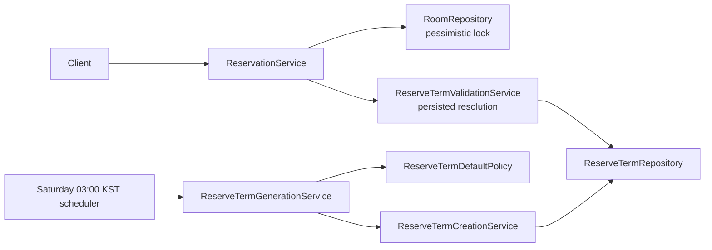

# 예약 로직 개요

예약 생성에서 서버는 역할, 방, DB에 저장된 예약 학기, 현재 KST를 조합해 `UNRESTRICTED`, `REGULAR`, `AD_HOC` 중 하나를 결정합니다. 클라이언트는 예약 유형을 보내지 않습니다. 클라이언트 계약은 [예약 정책 전환 안내](reservation-client-handoff.md), 운영 복구는 [ReserveTerm 복구 Runbook](reserve-term-recovery-runbook.md)을 참고합니다.

## 1. 구성 요소



- `ReserveTermPolicy`: KST clock, persisted time invariant, phase, AD_HOC opening, recurrence bound를 소유합니다.
- `ReserveTermDefaultPolicy`: scheduler 전용 current/next key와 기본 네 시각을 계산합니다. runtime 예약 판정에는 사용되지 않습니다.
- `ReserveTermValidationService`: 요청 시작 시각을 포함하는 행을 `Missing`, `Valid`, `Invalid`, `Multiple`로 분류합니다.
- `ReserveTermCreationService`: 기본 행 하나의 create-only transaction과 insert 실패 후 inspection transaction을 소유합니다.
- `ReserveTermGenerationService`: current와 next를 독립 처리합니다.

서버 시작 시 generation을 실행하지 않습니다.

## 2. Persisted schedule 계약

Runtime source of truth는 `reserve_term`에 저장된 다음 네 시각입니다.

```text
applyStartTime < applyEndTime <= termStartTime < termEndTime
```

`termYear`와 `termType`은 scheduler가 만든 기본 행을 식별하는 선택적이고 불변인 metadata입니다. 둘 다 `NULL`이거나 둘 다 값이 있어야 합니다. `NULL/NULL` custom 행도 정상 schedule이며, runtime authorization은 metadata나 기본 calendar와 저장 시각을 비교하지 않습니다.

요청 시작 시각 `requestStart`의 target query는 반열린 조건을 사용합니다.

```text
termStartTime <= requestStart < termEndTime
```

| 결과 | 의미 | Non-staff 동작 |
|---|---|---|
| `Missing` | 포함하는 행 0개 | 아래 2주 one-off fallback 검사 |
| `Valid` | 행 1개이고 시간 및 metadata-pair invariant 통과 | persisted phase 적용 |
| `Invalid` | 행 1개이나 invariant 위반 | `RESERVE-07 TERM_NOT_REGISTERED` |
| `Multiple` | 포함하는 행 2개 이상 | `RESERVE-07 TERM_NOT_REGISTERED` |

오직 `Missing`만 fallback을 엽니다. malformed 또는 ambiguous 데이터를 missing처럼 취급하지 않습니다.

`GET /api/v2/reservation/terms`는 전체 행을 한 번 조회합니다. Structural-invalid 행과 서로 겹치는 term-window component의 모든 행을 제외하고, valid non-overlap custom 및 `NULL/NULL` 행은 반환합니다. 맞닿은 경계는 overlap이 아닙니다.

## 3. 역할과 phase

Staff는 term과 독립적으로 `UNRESTRICTED`이며 설정된 반복 상한(기본 `20`)을 사용합니다. Non-staff는 세미나실, room ID 8의 professor gate, 생성 역할, 같은 날짜 및 최대 3시간 규칙을 먼저 통과해야 합니다.

Valid target의 phase/error table은 다음과 같습니다.

| Phase | Exact boundary | `ROLE_LABMASTER` | `ROLE_RESERVATION` |
|---|---|---|---|
| BEFORE_APPLICATION | `now < applyStartTime` | `RESERVE-08 TERM_NOT_OPENED` | `RESERVE-04 LABMASTER_ONLY` |
| REGULAR_APPLICATION | `applyStartTime <= now < applyEndTime` | `REGULAR` | `RESERVE-04 LABMASTER_ONLY` |
| GAP | `applyEndTime <= now < termStartTime` | `RESERVE-14 TERM_APPLICATION_CLOSED` | 동일 |
| TERM_ACTIVE | `termStartTime <= now` | one-off `AD_HOC` 검사 | 동일 |

`applyEndTime == termStartTime`이면 GAP은 비어 있습니다. Valid active AD_HOC opening은 다음 두 시각 중 늦은 값입니다.

```text
max(termStartTime, adjustWeekend(requestStart.date - 2 weeks at 09:00 Asia/Seoul))
```

`Missing` fallback에는 term start가 없으므로 weekend-adjusted 2주 opening만 사용합니다. 두 AD_HOC 경로 모두 `recurringWeeks == 1`이어야 하며, opening 전에는 `RESERVE-12`, 반복이면 `RESERVE-11`입니다. 공휴일 보정은 하지 않습니다.

## 4. Occurrence와 충돌

- `UNRESTRICTED`: 설정 상한과 지원 가능한 날짜 산술 범위 안에서 반복합니다.
- `REGULAR`: 모든 occurrence가 `termStartTime <= start < end <= termEndTime`이어야 합니다.
- Valid-term `AD_HOC`: 정확히 한 번이며 `end <= termEndTime`이어야 합니다.
- Missing `AD_HOC`: 정확히 한 번이며 term-end bound가 없습니다.

방 조회의 `PESSIMISTIC_WRITE` lock, occurrence별 overlap 검사, `saveAll`은 같은 transaction 안에 있습니다. 인증, room/role gate, cancellation 소유권 검사도 기존 동작을 유지합니다.

## 5. Create-only scheduler

토요일 03:00 `Asia/Seoul` scheduler는 current와 next labelled default를 각각 처리합니다.

1. `(termYear, termType)` key를 먼저 조회합니다.
2. Existing keyed row가 하나면 수정하지 않습니다. Structurally valid이면 `EXISTING`, invalid이면 `SKIPPED_INVALID_EXISTING`입니다.
3. Key가 없으면 default term window와 겹치는 모든 custom 행을 조회합니다.
4. 하나라도 겹치면 `SKIPPED_CUSTOM_OVERLAP`입니다. 경계가 맞닿기만 하면 insert를 막지 않습니다.
5. Key와 overlap이 모두 없을 때만 `CREATED`로 insert합니다.

Insert integrity failure가 creation transaction 밖으로 나온 뒤 별도 read-only transaction에서 실제 상태를 다시 읽습니다. Same-key valid row는 `CONCURRENTLY_CREATED`; invalid, overlap, multiple 또는 설명되지 않는 실패는 해당 상태로 기록하며 무조건 성공 처리하지 않습니다. Scheduler는 existing 행을 update/delete하거나 metadata를 부착하지 않습니다. External concurrent unkeyed writer 사이의 overlap은 unique key만으로 완전히 배제되지 않습니다.

## 6. 데이터와 시간 직렬화

V16은 legacy `reservation.reservation_type = NULL`과 `reserve_term`의 `NULL/NULL` metadata를 backfill하지 않습니다. Metadata pair CHECK와 full pair unique index만 적용합니다.

요청 `LocalDateTime`은 offset 없는 KST wall-clock 구성요소입니다. 응답은 기존 serializer 호환 때문에 **숫자 날짜·시각 구성요소를 보존한 채 trailing `Z`를 붙입니다**. 실제 UTC instant 변환이 아닙니다.

```text
stored:  2027-03-20T10:00
wire:    2027-03-20T10:00:00Z
display: 2027-03-20 10:00 KST
```

클라이언트가 일반 UTC instant로 변환하면 19:00으로 잘못 표시되므로 component-preserving parser를 사용해야 합니다.
