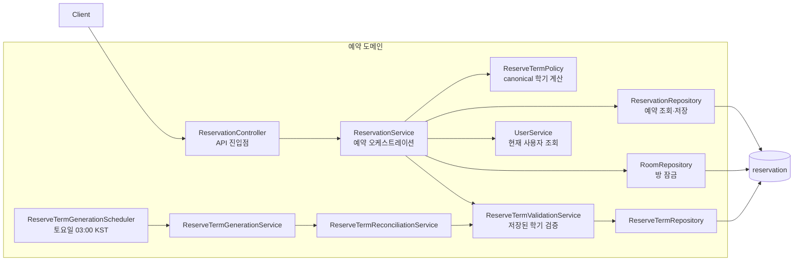
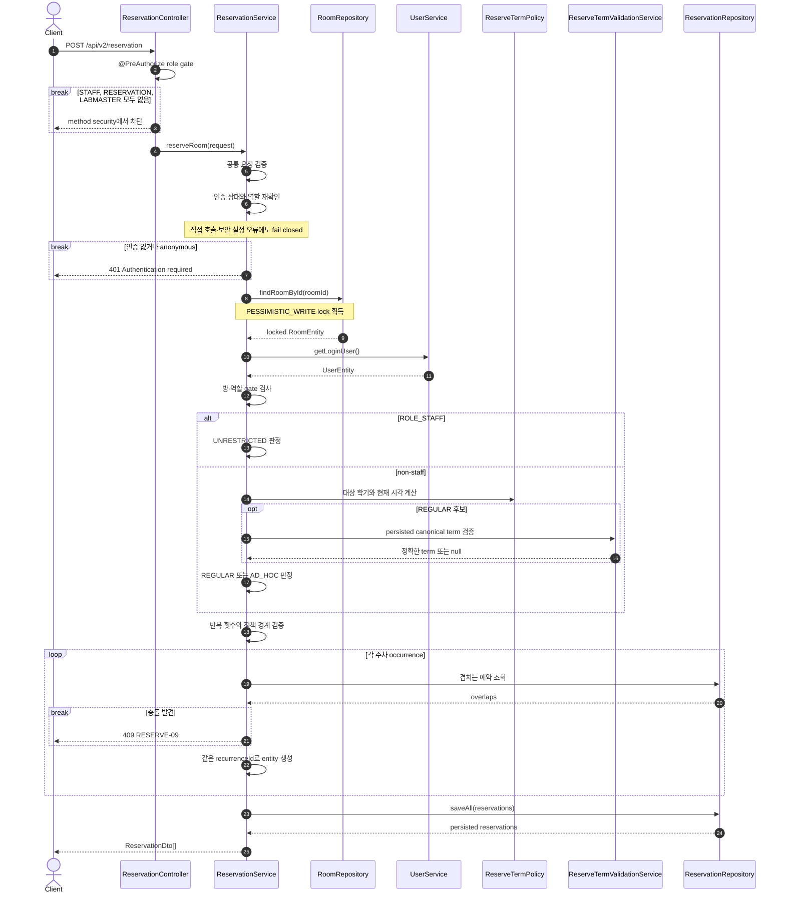
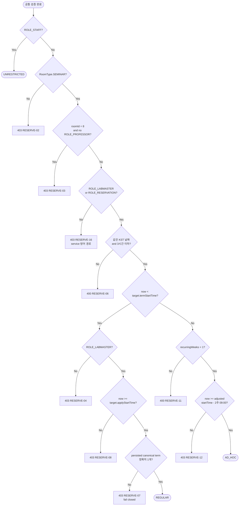
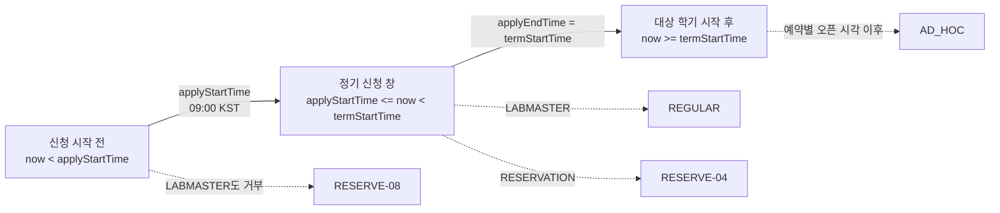
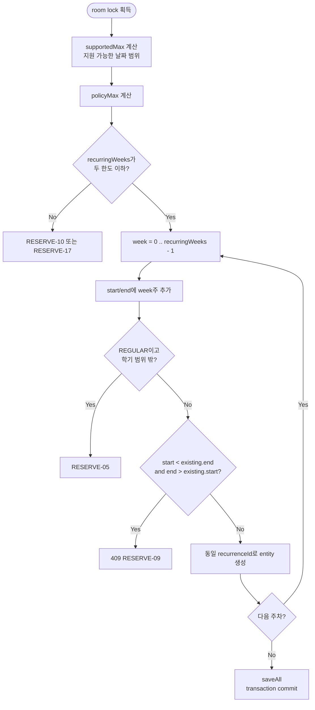
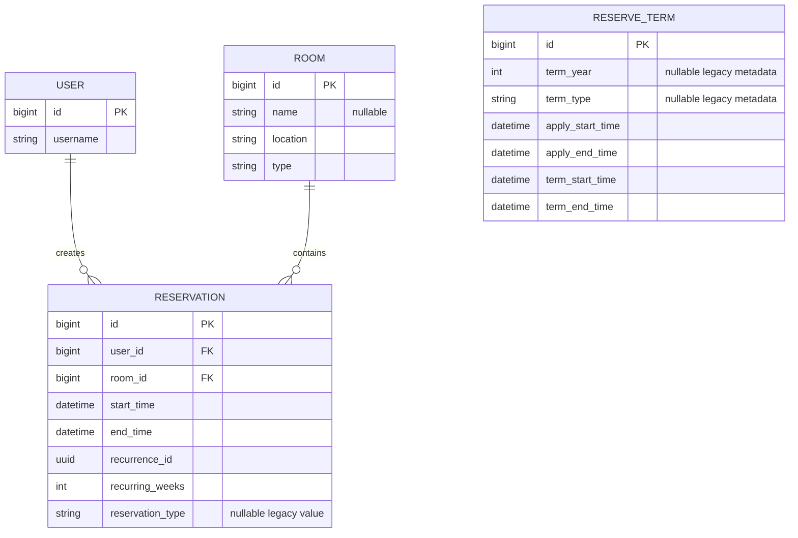
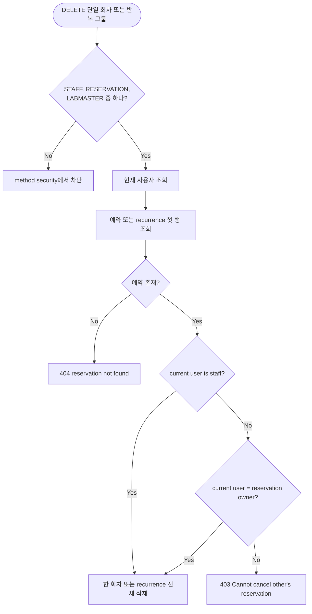
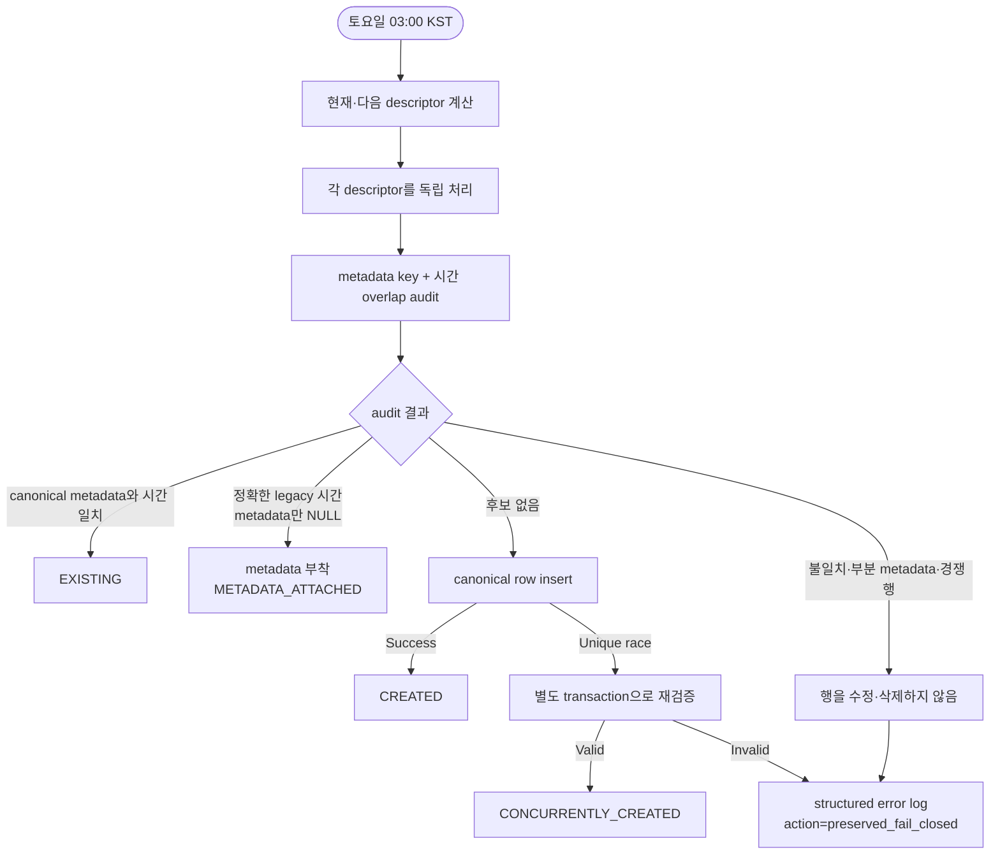

# 예약 로직 개요

이 문서는 예약 도메인을 처음 살펴보거나 변경하려는 백엔드 개발자가 **예약 요청이 어떤 경로를 거쳐 판정·저장되는지** 빠르게 이해하기 위한 설명 문서입니다.

핵심 원칙은 하나입니다.

> 클라이언트는 예약 의도와 시간을 보내고, 서버가 역할·방·대상 학기·현재 시각을 조합해 `UNRESTRICTED`, `REGULAR`, `AD_HOC` 중 하나를 결정합니다.

클라이언트 변경 사항은 [예약 API 클라이언트 전환 안내](reservation-client-handoff.md), 정기 예약 구간 장애 대응은 [정기 예약 구간 복구 Runbook](reserve-term-recovery-runbook.md)을 참고합니다.

## 1. 전체 구조



| 구성 요소 | 책임 |
|---|---|
| `ReservationController` | 조회·생성·취소 API와 method-level 권한 진입점 제공 |
| `ReservationService` | 요청 검증, 역할·방 검사, 정책 판정, 충돌 검사, 저장과 취소 조율 |
| `ReserveTermPolicy` | KST 현재 시각, canonical 학기, 신청 시작과 수시 예약 오픈 시각 계산 |
| `ReserveTermValidationService` | DB의 학기 행이 canonical descriptor와 정확히 일치하는지 검증 |
| `ReserveTermReconciliationService` | 누락 학기 생성 또는 정확한 legacy 행에 metadata 부착 |
| `ReserveTermGenerationService` | 현재·다음 학기 reconciliation을 독립적으로 실행하고 결과 기록 |

## 2. API 진입점

기본 경로는 `/api/v2/reservation`입니다.

| Method | Path | 핵심 동작 | 응답 |
|---|---|---|---|
| `GET` | `/month` | 방과 달을 기준으로 시작 시각 범위 조회 | `SimpleReservationDto[]` |
| `GET` | `/week` | 입력 날짜를 기준으로 7일 범위 조회 | `SimpleReservationDto[]` |
| `GET` | `/terms` | 검증에 통과한 canonical 학기만 조회 | `ReserveTermDto[]` |
| `GET` | `/{reservationId}` | 단일 예약 조회, staff 여부에 따라 연락처 노출 결정 | `ReservationDto` |
| `POST` | `/` | 서버가 예약 유형을 판정하고 한 번에 모든 회차 저장 | `ReservationDto[]` |
| `DELETE` | `/{reservationId}` | 한 회차만 취소 | 성공 시 `200 OK` |
| `DELETE` | `/recurring/{recurrenceId}` | 같은 반복 그룹 전체 취소 | 성공 시 `200 OK` |

`POST`와 `DELETE`는 `STAFF`, `RESERVATION`, `LABMASTER` 중 하나의 역할이 필요합니다. 조회 endpoint에는 controller method 수준의 `@PreAuthorize`가 없습니다. `/week`는 입력 날짜의 자정에서 9시간을 뺀 시각을 조회 시작점으로 사용하는 기존 호환 동작을 유지합니다.

## 3. 예약 생성 흐름

`POST`는 먼저 method security에서 생성 역할을 검사합니다. 이 gate를 통과한 요청만 하나의 transaction 안에서 처리되며, 같은 방에 대한 동시 요청은 `PESSIMISTIC_WRITE` room lock으로 직렬화됩니다.



### 공통 검증

정책 판정 전에 다음 조건을 모두 만족해야 합니다.

- `startTime`과 `endTime`의 연도가 `1001..9998` 범위에 있어야 합니다.
- `agreed`가 `true`여야 합니다.
- `startTime < endTime`이어야 합니다.
- `recurringWeeks >= 1`이어야 합니다.
- `startTime`은 KST 현재 시각보다 미래여야 합니다.

이 검증은 staff를 포함한 모든 생성 요청에 적용됩니다.

## 4. 서버 예약 유형 판정



역할 우선순위는 `STAFF > LABMASTER > RESERVATION`입니다. `ROLE_PROFESSOR`는 room ID 8을 통과하기 위한 추가 gate이며, 교수 역할만으로 예약 생성 권한이 생기지는 않습니다. 위 flowchart의 `RESERVE-16`은 service 직접 호출이나 method security 설정 오류에도 권한을 거부하기 위한 방어 경로이며, 정상 HTTP 요청은 controller gate에서 먼저 차단됩니다.

| 유형 | 대상 | 방 | 시점 | 반복 한도 | persisted term 의존 |
|---|---|---|---|---|---|
| `UNRESTRICTED` | `ROLE_STAFF` | 모든 방 | 미래 시각 | `1..csereal.reservation.max-recurring-weeks` | 없음 |
| `REGULAR` | `ROLE_LABMASTER` | 세미나실 | `[applyStartTime, termStartTime)` | 요청 전체가 학기 안에 들어가는 최대 주차 | 필수 |
| `AD_HOC` | `ROLE_LABMASTER` 또는 `ROLE_RESERVATION` | 세미나실 | 학기 시작 후이면서 예약별 오픈 시각 이후 | 정확히 1회 | 없음 |

## 5. 대상 학기와 예약 가능 시점

예약 정책은 **현재 활성화된 다른 학기**가 아니라 `request.startTime`이 속한 대상 학기를 기준으로 계산됩니다.



수시 예약의 실질적인 오픈 시각은 다음 두 시각 중 늦은 값입니다.

```text
max(target.termStartTime, adjustWeekend(request.startTime - 2 weeks at 09:00 KST))
```

`adjustWeekend`는 토요일이면 다음 월요일, 일요일이면 다음 월요일로 이동합니다. 공휴일은 보정하지 않습니다.

### Canonical 학기

모든 구간은 `[termStartTime, termEndTime)`의 반열린 범위입니다.

| `termType` | 학기 범위 | 신청 시작 기준일 |
|---|---|---|
| `WINTER` | 해당 연도 `01-01` ~ `03-01` | 전년도 `12-01 09:00` |
| `FIRST_SEMESTER` | 해당 연도 `03-01` ~ `07-01` | 해당 연도 `02-01 09:00` |
| `SUMMER` | 해당 연도 `07-01` ~ `09-01` | 해당 연도 `06-01 09:00` |
| `SECOND_SEMESTER` | 해당 연도 `09-01` ~ 다음 연도 `01-01` | 해당 연도 `08-01 09:00` |

신청 시작일이 주말이면 다음 월요일 09:00로 이동합니다. `applyEndTime`은 항상 `termStartTime`과 같습니다.

`REGULAR`은 DB의 `reserve_term`이 다음 값을 모두 정확히 만족해야 합니다.

- `termYear`, `termType`
- `applyStartTime`, `applyEndTime`
- `termStartTime`, `termEndTime`
- 같은 학기 범위에 겹치는 경쟁 행이 없음

하나라도 다르거나 후보가 여러 개면 자동 보정하지 않고 fail closed합니다. `AD_HOC`은 canonical descriptor만 계산하며 `reserve_term` 조회 결과에 의존하지 않습니다.

## 6. 반복 예약과 충돌 원자성



정책별 최대 반복 수는 다음과 같이 계산합니다.

- `UNRESTRICTED`: 설정값 `csereal.reservation.max-recurring-weeks`, 기본 `20`
- `REGULAR`: 마지막 회차의 `endTime`이 `termEndTime`을 넘지 않는 최대 주차
- `AD_HOC`: `1`
- 모든 유형: 마지막 회차가 시스템의 지원 시각 범위를 넘어갈 수 없음

같은 방의 lock은 사용자 DB 조회보다 먼저 획득하며 overlap 검사와 `saveAll`이 끝날 때까지 유지됩니다. 따라서 같은 방의 동시 요청은 한 요청씩 검사됩니다. 서로 다른 방은 독립적으로 처리할 수 있습니다.

Overlap 조건은 반열린 시간 구간을 사용하므로 기존 예약의 종료 시각과 새 예약의 시작 시각이 같은 인접 예약은 허용됩니다.

## 7. 데이터 모델



`reservation`과 `reserve_term` 사이에는 FK가 없습니다. 예약 생성 시 정책 검증에만 학기 데이터를 사용합니다.

- 같은 반복 요청의 모든 occurrence는 동일한 `recurrenceId`를 공유합니다.
- 신규 예약은 서버가 판정한 non-null `reservationType`을 저장합니다.
- V16 이전 예약의 `reservationType = null`은 정상 legacy 상태이며 추론하거나 backfill하지 않습니다.
- `(term_year, term_type)`에는 unique index가 있지만 MySQL nullable semantics 때문에 legacy `NULL/NULL` 행은 별도 validation이 필요합니다.

## 8. 조회와 취소

조회 결과의 노출 범위는 endpoint와 사용자 역할에 따라 달라집니다.

| 조회 | 노출 범위 |
|---|---|
| `/month`, `/week` | `id`, `title`, `startTime`, `endTime` |
| `/{reservationId}` — staff | 전체 `ReservationDto`, 사용자명과 연락처 포함 |
| `/{reservationId}` — non-staff | `userName`, `contactEmail`, `contactPhone`을 `null`로 마스킹 |

취소 권한은 controller와 service에서 두 단계로 검사합니다.



따라서 **허용된 세 역할 중 하나로 endpoint에 진입한 뒤, staff 또는 예약 소유자여야** 삭제할 수 있습니다. 역할이 없는 소유자는 method security를 통과하지 못합니다. 취소 service는 생성 전용 인증 helper를 재사용하지 않습니다. 단일 취소는 한 occurrence만, 반복 취소는 같은 `recurrenceId`의 모든 occurrence를 삭제합니다.

## 9. 정기 예약 학기 생성과 reconciliation

서버 시작 시에는 reconciliation을 실행하지 않습니다. scheduler는 매주 토요일 03:00 KST에 현재·다음 canonical 학기를 확인합니다.



각 `ensureTerm`은 `REQUIRES_NEW` transaction에서 실행되고 `ReserveTermGenerationService`가 descriptor별 실패를 수집합니다. 한 학기의 실패가 다른 학기의 확인을 중단시키지는 않습니다.

`GET /terms`도 동일한 validation을 사용해 정확한 canonical metadata와 네 시간 필드를 가진 행만 반환합니다. 잘못된 행은 숨기고 다음 정보를 error log에 남깁니다.

- `termYear`, `termType`, `reason`
- `candidateIds`
- canonical `expected`
- 실제 `actualCandidates`
- `action=preserved_fail_closed`

## 10. 시간과 응답 계약

정책 계산용 `Clock`은 `Asia/Seoul`을 사용합니다. 요청의 `LocalDateTime`은 offset 없는 local 문자열입니다.

응답은 전역 serializer의 기존 동작 때문에 숫자 날짜·시각 구성요소를 유지한 채 `Z`가 붙습니다. 이 값은 실제 UTC instant 변환 결과가 아닙니다.

```text
stored:   2027-03-20T10:00
wire:     2027-03-20T10:00:00Z
display:  2027-03-20 10:00 KST
```

클라이언트가 일반 UTC instant로 해석한 뒤 KST로 변환하면 `19:00`으로 잘못 표시됩니다. 자세한 호환 규칙은 [예약 API 클라이언트 전환 안내](reservation-client-handoff.md)를 참고합니다.

## 11. 변경 지점 찾기

| 변경하려는 내용 | 우선 확인할 구현 | 주요 테스트 |
|---|---|---|
| 역할·방·유형 판정 | [`ReservationService.kt`](../src/main/kotlin/com/wafflestudio/csereal/core/reservation/service/ReservationService.kt) | [`ReservationServiceTest.kt`](../src/test/kotlin/com/wafflestudio/csereal/core/reservation/service/ReservationServiceTest.kt) |
| 학기·오픈 시각 계산 | [`ReserveTermPolicy.kt`](../src/main/kotlin/com/wafflestudio/csereal/core/reservation/service/ReserveTermPolicy.kt) | [`ReserveTermPolicyTest.kt`](../src/test/kotlin/com/wafflestudio/csereal/core/reservation/service/ReserveTermPolicyTest.kt) |
| canonical term 검증 | [`ReserveTermValidationService.kt`](../src/main/kotlin/com/wafflestudio/csereal/core/reservation/service/ReserveTermValidationService.kt) | [`ReserveTermValidationServiceTest.kt`](../src/test/kotlin/com/wafflestudio/csereal/core/reservation/service/ReserveTermValidationServiceTest.kt) |
| term 생성·동시성 | [`ReserveTermReconciliationService.kt`](../src/main/kotlin/com/wafflestudio/csereal/core/reservation/service/ReserveTermReconciliationService.kt) | [`ReserveTermConcurrencyIntegrationTest.kt`](../src/test/kotlin/com/wafflestudio/csereal/core/reservation/service/ReserveTermConcurrencyIntegrationTest.kt) |
| 예약 충돌 동시성 | [`RoomRepository.kt`](../src/main/kotlin/com/wafflestudio/csereal/core/reservation/database/RoomRepository.kt) | [`ReservationConcurrencyIntegrationTest.kt`](../src/test/kotlin/com/wafflestudio/csereal/core/reservation/service/ReservationConcurrencyIntegrationTest.kt) |
| API·DTO 계약 | [`ReservationController.kt`](../src/main/kotlin/com/wafflestudio/csereal/core/reservation/api/v2/ReservationController.kt), [`ReservationDto.kt`](../src/main/kotlin/com/wafflestudio/csereal/core/reservation/dto/ReservationDto.kt) | [`ReserveRequestJsonCompatibilityTest.kt`](../src/test/kotlin/com/wafflestudio/csereal/core/reservation/dto/ReserveRequestJsonCompatibilityTest.kt) |
| DB metadata | [`V16__add_reservation_policy_metadata.sql`](../src/main/resources/db/migration/V16__add_reservation_policy_metadata.sql) | [`ReservationPolicyMigrationTest.kt`](../src/test/kotlin/com/wafflestudio/csereal/core/reservation/database/ReservationPolicyMigrationTest.kt) |

예약 로직을 변경할 때는 다음 invariant를 함께 확인합니다.

1. 클라이언트 입력이 아니라 서버가 `reservationType`을 결정하는가?
2. 같은 방의 lock 안에서 모든 overlap 검사와 저장이 끝나는가?
3. `REGULAR`만 persisted canonical term에 의존하고, 불일치 시 fail closed하는가?
4. `AD_HOC`은 target term과 예약별 오픈 시각으로만 판정되는가?
5. legacy `reservationType = null`과 legacy term metadata를 안전하게 유지하는가?
6. KST wall-clock과 응답의 trailing `Z` 호환 의미가 바뀌지 않았는가?
