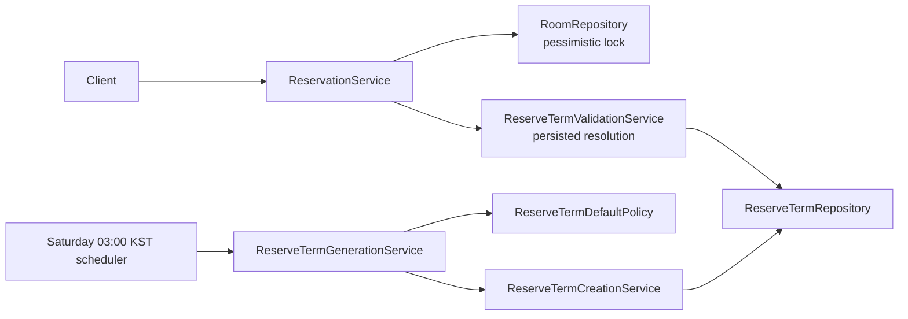

# 예약 로직 개요

서버는 예약을 생성할 때 역할, 방, DB에 저장된 예약 학기와 현재 UTC-component 시각을 조합해 `UNRESTRICTED`, `REGULAR`, `ONE_TIME` 중 하나를 결정합니다. 클라이언트는 예약 유형을 보내지 않습니다. API 계약은 [클라이언트 안내](reservation-client-handoff.md), 운영 복구 절차는 [ReserveTerm 복구 런북](reserve-term-recovery-runbook.md)을 참고하세요.

## 1. 구성 요소



- `ReserveTermPolicy`는 UTC-component 현재 시각, 저장된 시각의 조건, phase, `ONE_TIME` 오픈 시각과 반복 범위를 계산합니다. 달력 규칙이 필요한 경우에만 `Asia/Seoul` 날짜로 변환합니다.
- `ReserveTermDefaultPolicy`는 scheduler에서만 쓰는 current/next key와 기본 네 시각을 `Asia/Seoul` 일정 규칙으로 계산한 뒤 UTC components로 변환합니다. 예약 요청을 판정할 때는 사용하지 않습니다.
- `ReserveTermValidationService`는 요청 시작 시각을 포함하는 행을 `Missing`, `Valid`, `Invalid`, `Multiple`로 나눕니다.
- `ReserveTermCreationService`는 기본 행 하나를 생성하는 create-only transaction과 insert 실패 뒤 상태를 확인하는 transaction을 관리합니다.
- `ReserveTermGenerationService`는 current와 next를 서로 독립적으로 처리합니다.

서버가 시작될 때는 term을 생성하지 않습니다.

## 2. 저장 일정 계약

예약 정책은 `reserve_term`에 저장된 다음 네 시각을 유일한 기준으로 사용합니다.

애플리케이션 내부의 네 시각과 `/terms` 응답은 UTC components입니다. 예를 들어 기본 신청 시작 09:00 `Asia/Seoul`은 `00:00Z`, term 경계의 KST 자정은 전날 `15:00Z`입니다. 기존 JDBC 변환을 거쳐 DB에서 조회되는 값은 의도한 `Asia/Seoul` wall-clock 구성요소입니다.

```text
applyStartTime < applyEndTime <= termEndTime
termStartTime < termEndTime
```

`applyStartTime`부터 `applyEndTime`까지의 신청 기간(application window)은 term 시작과 겹치거나 term 안에서 시작할 수 있습니다. 다만 application 종료는 term 종료를 넘을 수 없습니다. `termYear`와 `termType`은 scheduler가 생성한 기본 행을 식별하는 선택값이며, 한 번 저장하면 수정하지 않습니다. 두 필드는 모두 `NULL`이거나 모두 값이 있어야 합니다.

`NULL/NULL` custom 행도 유효한 일정입니다. 권한을 판정할 때는 metadata나 기본 일정과 저장 시각을 비교하지 않습니다.

요청 시작 시각 `requestStart`의 대상 term은 다음 반열린 조건으로 찾습니다.

```text
termStartTime <= requestStart < termEndTime
```

| 결과 | 의미 | Non-staff 동작 |
|---|---|---|
| `Missing` | 포함하는 행이 없음 | 2주 `ONE_TIME` 대체 규칙 검사 |
| `Valid` | 행이 하나이고 시각 및 metadata pair 조건을 만족함 | 저장된 phase 적용 |
| `Invalid` | 행이 하나지만 조건을 어김 | `RESERVE-07 TERM_NOT_REGISTERED` |
| `Multiple` | 포함하는 행이 두 개 이상임 | `RESERVE-07 TERM_NOT_REGISTERED` |

대체 규칙은 `Missing`에만 적용합니다. 형식이 잘못됐거나 후보가 여러 개인 데이터를 누락으로 간주하지 않습니다.

`GET /api/v2/reservation/terms`는 전체 행을 한 번 조회합니다. 구조 조건을 어긴 행과 서로 겹치는 term 구간의 모든 행은 제외합니다. 겹치지 않는 유효한 custom 행과 `NULL/NULL` 행은 반환하며, 경계가 맞닿은 경우는 overlap으로 보지 않습니다.

## 3. 역할과 phase

Staff는 term과 관계없이 `UNRESTRICTED`이며, 설정된 반복 상한을 적용합니다. 기본값은 `20`입니다. Non-staff는 먼저 세미나실 여부, room ID 8의 `ROLE_PROFESSOR` 조건, 생성 역할, 같은 날짜 및 최대 3시간 규칙을 통과해야 합니다.

유효한 대상 term의 phase는 다음 순서로 판정합니다. 신청 기간이 열려 있으면 term 활성 여부와 관계없이 `REGULAR_APPLICATION`이 우선합니다. 신청 기간 밖의 활성 term은 `TERM_ACTIVE`입니다.

| 우선순위 | Phase | 정확한 경계 | `ROLE_LABMASTER` | `ROLE_RESERVATION` |
|---:|---|---|---|---|
| 1 | REGULAR_APPLICATION | `applyStartTime <= now < applyEndTime` | `REGULAR` | `RESERVE-04 LABMASTER_ONLY` |
| 2 | TERM_ACTIVE | 신청 기간 밖이고 `termStartTime <= now` | `ONE_TIME` 검사 | 동일 |
| 3 | BEFORE_APPLICATION | `now < applyStartTime`이고 `now < termStartTime` | `RESERVE-08 TERM_NOT_OPENED` | `RESERVE-04 LABMASTER_ONLY` |
| 4 | GAP | `applyEndTime <= now < termStartTime` | `RESERVE-14 TERM_APPLICATION_CLOSED` | 동일 |

Term 안에서 신청 기간이 열리면 phase는 `TERM_ACTIVE -> REGULAR_APPLICATION -> TERM_ACTIVE` 순서로 바뀝니다. `applyEndTime == termStartTime`이면 GAP은 없습니다.

유효한 활성 term에서 `ONE_TIME` 예약이 열리는 시각은 다음 두 값 중 늦은 값입니다.

```text
max(termStartTime UTC, toUtc(adjustWeekend(toSeoulDate(requestStart UTC) - 2 weeks at 09:00 Asia/Seoul)))
```

`Missing` 대체 규칙에는 term 시작 시각이 없으므로 주말을 보정한 2주 전 오픈 시각만 사용합니다. 두 `ONE_TIME` 경로 모두 `recurringWeeks == 1`이어야 합니다. 오픈 전에는 `RESERVE-12`, 반복 요청에는 `RESERVE-11`을 반환합니다. 공휴일은 보정하지 않습니다.

## 4. 예약 회차와 충돌

- `UNRESTRICTED`: 설정된 상한과 지원 가능한 날짜 계산 범위 안에서 반복할 수 있습니다.
- `REGULAR`: 모든 회차가 `termStartTime <= start < end <= termEndTime`을 만족해야 합니다.
- 유효한 term의 `ONE_TIME`: 한 번만 예약할 수 있고 `end <= termEndTime`이어야 합니다.
- `Missing` 상태의 `ONE_TIME`: 한 번만 예약할 수 있으며 term 종료 제한은 없습니다.

방을 조회하는 `PESSIMISTIC_WRITE` lock, 회차별 overlap 검사와 `saveAll`은 하나의 transaction 안에서 실행됩니다. 인증, room/role 조건과 취소 권한 검사는 기존 동작을 유지합니다.

## 5. Create-only scheduler

Scheduler는 매주 토요일 03:00 `Asia/Seoul`에 current와 next 기본 term을 각각 처리합니다.

1. `(termYear, termType)` key를 먼저 조회합니다.
2. Key가 있는 행이 하나면 수정하지 않습니다. 구조 조건을 만족하면 `EXISTING`, 어기면 `SKIPPED_INVALID_EXISTING`입니다.
3. Key가 없으면 기본 term 구간과 겹치는 custom 행을 모두 조회합니다.
4. 하나라도 겹치면 `SKIPPED_CUSTOM_OVERLAP`입니다. 경계만 맞닿은 경우에는 insert를 막지 않습니다.
5. Key와 overlap이 모두 없을 때만 행을 insert하고 `CREATED`를 반환합니다.

Insert transaction이 integrity failure로 끝나면 별도의 read-only transaction에서 상태를 다시 확인합니다. 같은 key의 유효한 행이 있으면 `CONCURRENTLY_CREATED`입니다. Invalid, overlap, multiple이거나 원인을 설명할 수 없는 실패는 해당 실패 상태로 기록합니다. 모든 실패를 race 성공으로 간주하지 않습니다.

Scheduler는 기존 행을 update하거나 delete하지 않으며 metadata도 덧붙이지 않습니다. Key 없는 행을 외부에서 동시에 쓰는 경우에는 unique key만으로 overlap을 완전히 막을 수 없습니다.

## 6. 데이터와 시간 직렬화

V16은 기존 `reservation.reservation_type = NULL`과 `reserve_term`의 `NULL/NULL` metadata를 채우지 않습니다. Metadata pair CHECK와 값이 모두 있는 pair의 unique index만 추가합니다.

예약 요청과 응답의 `LocalDateTime` 숫자 구성요소는 UTC입니다. 요청은 `Z`가 붙은 형식과 기존 offset 없는 형식을 모두 역직렬화하지만, 두 형식 모두 같은 UTC 구성요소로 정책에 전달됩니다. 응답의 `Z`는 실제 UTC instant를 뜻합니다.

```text
request: 2027-03-20T01:00:00Z
wire:    2027-03-20T01:00:00Z
display: 2027-03-20 10:00 KST
```

클라이언트는 표준 instant parser로 응답을 해석한 뒤 사용자 timezone으로 표시합니다. offset 없는 요청을 사용하는 기존 클라이언트도 숫자 구성요소를 UTC로 보내야 합니다.

ReserveTerm의 내부 값과 `GET /api/v2/reservation/terms` 응답도 실제 UTC components입니다. 기본 일정은 `Asia/Seoul` 달력 규칙으로 계산한 뒤 UTC로 변환하므로 `2027-02-01T00:00:00Z`는 `2027-02-01 09:00 Asia/Seoul`을 뜻합니다. Custom term POST는 기존 offset 없는 `LocalDateTime` JSON shape을 유지하며 입력한 UTC 숫자 구성요소를 그대로 전달합니다.
