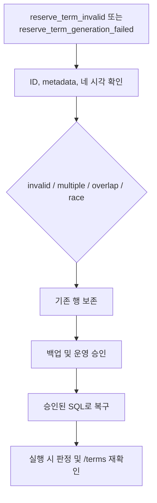

# ReserveTerm 복구 런북

## 1. 실행 전 확인

ReserveTerm create-only scheduler는 매주 토요일 03:00 `Asia/Seoul`에만 실행됩니다. 서버가 시작될 때는 term을 생성하지 않습니다. 예약 권한은 DB에 저장된 네 시각으로 판정하며, 기본 일정과 비교하거나 운영자가 만든 행을 자동으로 수정하지 않습니다.



## 2. 모니터링 event

| Event | 의미 | 주요 필드 |
|---|---|---|
| `reserve_term_invalid` | 실행 중 판정이나 목록 조회에서 구조 조건 위반, multiple 또는 overlap 발견 | `reason`, `candidateIds`, `actualCandidates`, `action=preserved_fail_closed` |
| `reserve_term_generation_failed` | 기존 행이 유효하지 않거나 insert/상태 확인에 실패 | `termYear`, `termType`, `reason`, `candidateIds`, `actualCandidates`, `action=preserved_create_only` |
| `reserve_term_generation` | Create-only 처리 성공 | `termYear`, `termType`, `result` |

`actualCandidates`에는 행 ID, 선택값인 `termYear`와 `termType`, `applyStartTime`, `applyEndTime`, `termStartTime`, `termEndTime`만 기록합니다. 사용자 정보, 예약 제목이나 연락처 같은 PII는 기록하지 않습니다.

Generation 결과는 다음과 같습니다.

- `CREATED`: key와 겹치는 custom 행이 없어 metadata가 있는 기본 행을 insert했습니다.
- `EXISTING`: 같은 key의 유효한 행을 그대로 보존했습니다. 기본 시각과 달라도 수정하지 않습니다.
- `SKIPPED_INVALID_EXISTING`: 같은 key의 행이 일정 조건을 어겨 그대로 보존했습니다.
- `SKIPPED_CUSTOM_OVERLAP`: key는 없지만 겹치는 custom 행이 있어 insert하지 않았습니다.
- `CONCURRENTLY_CREATED`: insert transaction이 실패한 뒤 별도의 read-only transaction에서 같은 key의 유효한 행을 확인했습니다.
- `FAILED_INVALID_STATE`: 같은 key의 행이 여러 개이거나 서로 모순되는 상태를 발견했습니다.
- `FAILED`: integrity failure 뒤 다시 조회해도 key나 overlap으로 원인을 설명할 수 없거나, 상태 확인 자체가 실패했습니다.

Current 처리에 실패해도 next는 계속 처리합니다. 모든 integrity exception을 race 성공으로 간주하지 않습니다.

## 3. DB 상태 확인

실행 시 적용하는 일정 조건은 다음과 같습니다.

```text
apply_start_time < apply_end_time <= term_end_time
term_start_time < term_end_time
```

`apply_start_time`부터 `apply_end_time`까지의 신청 기간(application window)은 term 시작과 겹치거나 term 안에서 시작할 수 있지만, term 종료를 넘을 수는 없습니다. Metadata는 `(term_year IS NULL AND term_type IS NULL)`이거나 값이 모두 있는 pair여야 합니다. `NULL/NULL`은 유효한 custom 또는 기존 일정입니다.

전체 행을 먼저 확인합니다.

```sql
SELECT id, term_year, term_type,
       apply_start_time, apply_end_time, term_start_time, term_end_time
FROM reserve_term
ORDER BY term_start_time, id;
```

특정 요청 시작 시각의 대상 후보는 다음 반열린 조건으로 찾습니다.

```sql
SELECT id, term_year, term_type,
       apply_start_time, apply_end_time, term_start_time, term_end_time
FROM reserve_term
WHERE term_start_time <= :request_start
  AND term_end_time > :request_start
ORDER BY id;
```

- 후보가 없으면 `Missing`이며, 2주 `ONE_TIME` 대체 규칙을 적용할 수 있습니다.
- 후보가 하나이고 유효하면 저장된 phase를 적용합니다.
- 후보가 하나지만 조건을 어기면 `Invalid`이며 `RESERVE-07`로 요청을 차단합니다.
- 후보가 두 개 이상이면 `Multiple`이며 `RESERVE-07`로 요청을 차단합니다.

기본 행 생성 여부를 판단할 때는 overlap보다 key를 먼저 확인합니다.

```sql
SELECT id, term_year, term_type,
       apply_start_time, apply_end_time, term_start_time, term_end_time
FROM reserve_term
WHERE (term_year = :term_year AND term_type = :term_type)
   OR (term_start_time < :default_term_end AND term_end_time > :default_term_start)
ORDER BY id;
```

`existing.term_end_time = default.term_start_time`처럼 경계만 맞닿은 경우는 overlap이 아닙니다. key 없는 행을 외부에서 동시에 쓰면 `(term_year, term_type)` unique index만으로 overlap을 완전히 막을 수 없습니다. 이 경우 별도의 운영 감시가 필요합니다.

기존 `reservation.reservation_type IS NULL`은 정상이며 값을 채우지 않습니다.

## 4. 복구 절차

1. Event의 candidate ID와 current/next key를 기록합니다.
2. 대상 행과 관련 예약을 백업하고 담당자 승인을 받습니다.
3. 대상 term 조회 쿼리로 `Missing`, `Invalid`, `Multiple` 중 어느 상태인지 재현합니다.
4. 네 시각의 조건, 선택적 metadata pair와 다른 term 구간의 overlap을 확인합니다.
5. 원인이 분명하고 승인을 받은 경우에만 SQL로 값을 수정하거나 충돌 행을 제거합니다. Scheduler는 기존 행을 update 또는 delete하거나 metadata를 바꾸지 않습니다.
6. Commit한 뒤 같은 쿼리로 유효한 대상이 정확히 하나인지 다시 확인합니다.
7. `/api/v2/reservation/terms`에 겹치지 않는 유효한 행만 보이는지 확인합니다.
8. Current와 next를 각각 확인합니다. 다음 토요일 전에 수동 generation이 필요하면 별도의 운영 승인을 받습니다.

DB 변경이 안전하지 않거나 원인을 알 수 없으면 행을 보존하고 운영 장애 대응 절차로 넘깁니다.

## 5. V16과 시간 처리

V16은 기존 `reservation_type = NULL`과 `reserve_term`의 `NULL/NULL` metadata를 유지하며 metadata pair CHECK를 추가합니다. 다른 checksum의 V16이 이미 배포된 증거가 있다면 파일이나 migration history를 임의로 고치지 말고 forward migration을 설계해야 합니다.

API 응답 시각은 `LocalDateTime`의 날짜·시각 구성요소를 유지한 채 끝에 `Z`를 붙이는 기존 형식입니다. 이 API에서 `2027-03-20T10:00:00Z`는 실제 UTC instant가 아니라 `10:00 KST` wall-clock을 뜻합니다. 운영 확인 도구도 날짜·시각 구성요소를 유지해 표시해야 합니다. 이 방식을 component-preserving 처리라고 부릅니다.
