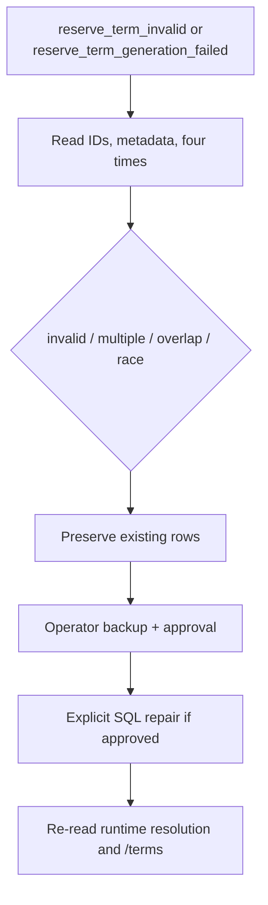

# ReserveTerm 복구 Runbook

## 1. 동작 전제

ReserveTerm create-only generation scheduler는 **매주 토요일 03:00 `Asia/Seoul`에만** 실행됩니다. Startup generation은 없습니다. Runtime reservation authorization은 DB에 저장된 네 시각을 그대로 사용하며 default calendar와 비교하거나 operator row를 자동 수정하지 않습니다.



## 2. 모니터링 event

| Event | 의미 | 주요 필드 |
|---|---|---|
| `reserve_term_invalid` | Runtime/listing에서 structural invalid, multiple 또는 overlap 발견 | `reason`, `candidateIds`, `actualCandidates`, `action=preserved_fail_closed` |
| `reserve_term_generation_failed` | Existing invalid state 또는 insert/inspection 실패 | `termYear`, `termType`, `reason`, `candidateIds`, `actualCandidates`, `action=preserved_create_only` |
| `reserve_term_generation` | Create-only 정상 outcome | `termYear`, `termType`, `result` |

`actualCandidates`는 row ID, optional `termYear`/`termType`, `applyStartTime`, `applyEndTime`, `termStartTime`, `termEndTime`만 포함합니다. 사용자, 예약 제목, 연락처 같은 PII는 기록하지 않습니다.

Generation outcome은 다음과 같습니다.

- `CREATED`: key와 custom overlap이 없어 labelled default를 insert했습니다.
- `EXISTING`: structurally valid keyed row를 그대로 보존했습니다. Default와 시간이 달라도 수정하지 않습니다.
- `SKIPPED_INVALID_EXISTING`: keyed row가 있지만 schedule invariant가 잘못되어 보존했습니다.
- `SKIPPED_CUSTOM_OVERLAP`: key는 없지만 custom overlap이 있어 insert하지 않았습니다.
- `CONCURRENTLY_CREATED`: insert transaction 실패 후 별도 read-only transaction에서 valid same-key row를 확인했습니다.
- `FAILED_INVALID_STATE`: 방어적으로 multiple keyed/contradictory state를 발견했습니다.
- `FAILED`: integrity failure를 재조회한 뒤에도 설명할 key/overlap이 없거나 inspection 자체가 실패했습니다.

Current 실패가 next 처리를 중단하지 않습니다. 모든 integrity exception을 race 성공으로 취급하지 않습니다.

## 3. DB 확인

Runtime schedule invariant는 정확히 다음과 같습니다.

```text
apply_start_time < apply_end_time <= term_start_time < term_end_time
```

Metadata는 `(term_year IS NULL AND term_type IS NULL)` 또는 full pair여야 합니다. `NULL/NULL`은 정상 custom/legacy schedule입니다.

```sql
SELECT id, term_year, term_type,
       apply_start_time, apply_end_time, term_start_time, term_end_time
FROM reserve_term
ORDER BY term_start_time, id;
```

특정 요청 시작 시각의 target 후보는 다음 반열린 조건으로 확인합니다.

```sql
SELECT id, term_year, term_type,
       apply_start_time, apply_end_time, term_start_time, term_end_time
FROM reserve_term
WHERE term_start_time <= :request_start
  AND term_end_time > :request_start
ORDER BY id;
```

- 0개: `Missing`; 2주 one-off AD_HOC fallback이 가능합니다.
- 1개 valid: persisted phase가 적용됩니다.
- 1개 malformed: `Invalid`; `RESERVE-07`로 fail closed합니다.
- 2개 이상: `Multiple`; `RESERVE-07`로 fail closed합니다.

Default generation 점검은 key를 overlap보다 먼저 확인합니다.

```sql
SELECT id, term_year, term_type,
       apply_start_time, apply_end_time, term_start_time, term_end_time
FROM reserve_term
WHERE (term_year = :term_year AND term_type = :term_type)
   OR (term_start_time < :default_term_end AND term_end_time > :default_term_start)
ORDER BY id;
```

맞닿은 `existing.term_end_time = default.term_start_time`은 overlap이 아닙니다. External concurrent unkeyed writer끼리의 overlap은 `(term_year, term_type)` unique index로 완전히 차단되지 않으므로 별도 운영 감시가 필요합니다.

Legacy `reservation.reservation_type IS NULL`은 정상이며 backfill하지 않습니다.

## 4. 복구 절차

1. Event의 candidate ID와 current/next key를 기록합니다.
2. 대상 행과 관련 예약을 백업하고 담당자 승인을 받습니다.
3. Runtime target query로 `Missing`, `Invalid`, `Multiple` 중 무엇인지 재현합니다.
4. 네 시각 invariant, optional metadata pair, 다른 term window와의 overlap을 확인합니다.
5. 원인이 명확하고 승인된 경우에만 SQL로 수정하거나 충돌 행을 제거합니다. Scheduler는 existing row를 update/delete하거나 metadata를 변경하지 않습니다.
6. Commit 후 같은 query로 정확히 한 valid target인지 재확인합니다.
7. `/api/v2/reservation/terms`에 valid non-overlap 행만 보이는지 확인합니다.
8. Current와 next를 각각 확인합니다. 다음 토요일 전 수동 generation이 필요하면 별도 운영 승인을 받습니다.

DB 변경이 안전하지 않거나 원인이 불명확하면 행을 보존하고 운영 장애로 escalation합니다.

## 5. V16과 시간 주의사항

V16은 legacy `reservation_type = NULL` 및 `reserve_term`의 `NULL/NULL` metadata를 유지하고 metadata-pair CHECK를 추가합니다. 이미 다른 checksum의 V16이 배포된 증거가 있으면 파일을 고치거나 history를 repair하지 말고 forward migration을 설계해야 합니다.

API 응답 시각은 LocalDateTime 숫자 구성요소를 보존한 채 trailing `Z`가 붙는 기존 호환 형식입니다. `2027-03-20T10:00:00Z`는 이 API에서 실제 UTC instant 변환이 아니라 `10:00 KST` wall-clock을 뜻합니다. 운영 확인 도구도 component-preserving 방식으로 표시해야 합니다.
