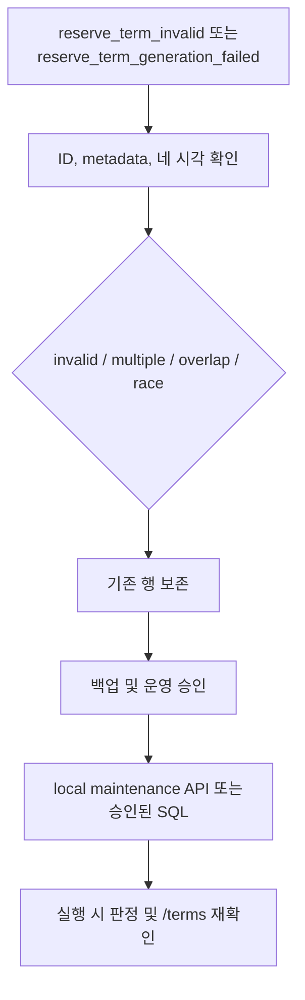

# ReserveTerm 복구 런북

## 1. 실행 전 확인

ReserveTerm create-only scheduler는 매주 토요일 03:00 `Asia/Seoul`에만 실행됩니다. 서버가 시작될 때는 term을 생성하지 않습니다. 예약 권한은 DB에 저장된 네 시각으로 판정하며, 기본 일정과 비교하거나 운영자가 만든 행을 자동으로 수정하지 않습니다.



## 2. Local maintenance API

아래 두 유지보수 엔드포인트는 **컨테이너 내부(loopback) 호출만** 허용합니다(백엔드 `requireLoopback`). 학외에서는 OAuth 로그인이 안 돼 세션 인증을 붙이면 운영자가 못 쓰므로, IP·인증이 아니라 loopback으로 막습니다. 따라서 운영에서는 SSH로 호스트에 들어가 컨테이너 안에서 호출합니다.

```bash
ssh <prod-host>
docker exec <backend-container> \
  curl -s -X POST http://localhost:8080/api/v2/reservation/terms/custom \
  -H 'Content-Type: application/json' -d @- <<'JSON'
{ ... }
JSON
```

외부(도메인·IP 직결·프록시 경유)에서 호출하면 `403`입니다. 공개 조회인 `GET /api/v2/reservation/terms`에는 이 제한을 적용하지 않습니다. 예전에는 Caddy가 `remote_ip == {$LOCAL_IP}`로 막았으나, 사설 IP가 이관마다 바뀌고 IP 직결 우회가 열려 백엔드 loopback으로 옮겼습니다.

### Custom term 생성

`POST /api/v2/reservation/terms/custom`은 네 개의 UTC-component 시각을 기존 offset 없는 `LocalDateTime` JSON shape으로 받고 그대로 전달하여 `termYear=NULL`, `termType=NULL`인 행을 생성합니다. `reserve_term` 컬럼은 MySQL `DATETIME(6)`이므로 DB에는 전달된 `LocalDateTime` 구성요소가 그대로 저장됩니다.

```json
{
  "applyStartTime": "2027-02-01T00:00:00",
  "applyEndTime": "2027-02-28T15:00:00",
  "termStartTime": "2027-02-28T15:00:00",
  "termEndTime": "2027-06-30T15:00:00"
}
```

유효하지 않은 일정은 `400`, 기존 term 구간과 겹치면 `409`, 생성 성공은 `201`입니다. Term 구간은 반열린 구간이므로 경계만 맞닿으면 생성할 수 있습니다. Overlap 조회와 insert는 순차적인 check-only 처리입니다. 동시에 들어온 custom 생성 사이의 interval race를 DB 제약으로 막지 못하는 잔여 위험이 있으므로 호출을 직렬화하고 생성 후 전체 term overlap을 확인해야 합니다.

### Current/next default backfill

Body 없이 `POST /api/v2/reservation/terms/defaults`를 호출하면 current와 next를 create-only 방식으로 각각 처리하고 항상 두 결과를 `200`으로 반환합니다. 한쪽 실패가 다른 쪽 처리를 막지 않습니다. 응답 항목은 `termYear`, `termType`, `result`, 안전하게 정규화한 `reason`만 포함하며 exception, stack trace, candidate 행은 노출하지 않습니다. `CREATED`, `EXISTING`, `CONCURRENTLY_CREATED`의 `reason`은 `null`입니다.

호출 뒤 event와 `GET /api/v2/reservation/terms`를 함께 확인합니다. 이 API는 기존 행을 update, delete 또는 repair하지 않습니다.

## 3. 모니터링 event

| Event | 의미 | 주요 필드 |
|---|---|---|
| `reserve_term_invalid` | 실행 중 판정이나 목록 조회에서 구조 조건 위반, multiple 또는 overlap 발견 | `reason`, `candidateIds`, `actualCandidates`, `action=preserved_fail_closed` |
| `reserve_term_generation_failed` | 기존 행이 유효하지 않거나 insert/상태 확인에 실패 | `termYear`, `termType`, `reason`, `candidateIds`, `actualCandidates`, `action=preserved_create_only` |
| `reserve_term_generation` | Create-only 처리 성공 | `termYear`, `termType`, `result` |

`actualCandidates`에는 행 ID, 선택값인 `termYear`와 `termType`, `applyStartTime`, `applyEndTime`, `termStartTime`, `termEndTime`만 기록합니다. 사용자 정보, 예약 제목이나 연락처 같은 PII는 기록하지 않습니다.

Generation 결과는 다음과 같습니다.

- `CREATED`: key와 겹치는 custom 행이 없어 metadata가 있는 기본 행을 insert했습니다.
- `EXISTING`: 같은 key의 유효한 행을 그대로 보존했습니다. 기본 시각과 달라도 수정하지 않습니다.
- `SKIPPED_INVALID_EXISTING`: 같은 key의 행이 일정 조건을 어겨 그대로 보존했습니다.
- `SKIPPED_CUSTOM_OVERLAP`: key는 없지만 겹치는 custom 행이 있어 insert하지 않았습니다.
- `CONCURRENTLY_CREATED`: insert transaction이 실패한 뒤 별도의 read-only transaction에서 같은 key의 유효한 행을 확인했습니다.
- `FAILED_INVALID_STATE`: 같은 key의 행이 여러 개이거나 서로 모순되는 상태를 발견했습니다.
- `FAILED`: integrity failure 뒤 다시 조회해도 key나 overlap으로 원인을 설명할 수 없거나, 상태 확인 자체가 실패했습니다.

Current 처리에 실패해도 next는 계속 처리합니다. 모든 integrity exception을 race 성공으로 간주하지 않습니다.

## 4. DB 상태 확인

실행 시 적용하는 일정 조건은 다음과 같습니다.

```text
apply_start_time < apply_end_time <= term_end_time
term_start_time < term_end_time
```

`apply_start_time`부터 `apply_end_time`까지의 신청 기간(application window)은 term 시작과 겹치거나 term 안에서 시작할 수 있지만, term 종료를 넘을 수는 없습니다. Metadata는 `(term_year IS NULL AND term_type IS NULL)`이거나 값이 모두 있는 pair여야 합니다. `NULL/NULL`은 유효한 custom 또는 기존 일정입니다.

전체 행을 먼저 확인합니다.

```sql
SELECT id, term_year, term_type,
       apply_start_time, apply_end_time, term_start_time, term_end_time
FROM reserve_term
ORDER BY term_start_time, id;
```

특정 요청 시작 시각의 대상 후보는 다음 반열린 조건으로 찾습니다.

아래 직접 SQL의 `:request_start`, `:default_term_start`, `:default_term_end`는 raw MySQL `DATETIME`과 비교되므로 API의 UTC components가 아니라 DB에 저장되는 `Asia/Seoul` wall-clock 구성요소로 바인딩해야 합니다. 예를 들어 API의 `2027-03-20T01:00:00Z`는 직접 SQL에서 `2027-03-20 10:00:00`으로 바인딩합니다. 애플리케이션/JPA 실행은 기존 JDBC representation path를 거치지만, 운영자가 raw SQL을 실행할 때는 이 변환을 직접 적용해야 합니다.

```sql
SELECT id, term_year, term_type,
       apply_start_time, apply_end_time, term_start_time, term_end_time
FROM reserve_term
WHERE term_start_time <= :request_start
  AND term_end_time > :request_start
ORDER BY id;
```

- 후보가 없으면 `Missing`이며, 2주 `ONE_TIME` 대체 규칙을 적용할 수 있습니다.
- 후보가 하나이고 유효하면 저장된 phase를 적용합니다.
- 후보가 하나지만 조건을 어기면 `Invalid`이며 `RESERVE-07`로 요청을 차단합니다.
- 후보가 두 개 이상이면 `Multiple`이며 `RESERVE-07`로 요청을 차단합니다.

기본 행 생성 여부를 판단할 때는 overlap보다 key를 먼저 확인합니다.

```sql
SELECT id, term_year, term_type,
       apply_start_time, apply_end_time, term_start_time, term_end_time
FROM reserve_term
WHERE (term_year = :term_year AND term_type = :term_type)
   OR (term_start_time < :default_term_end AND term_end_time > :default_term_start)
ORDER BY id;
```

`existing.term_end_time = default.term_start_time`처럼 경계만 맞닿은 경우는 overlap이 아닙니다. key 없는 행을 외부에서 동시에 쓰면 `(term_year, term_type)` unique index만으로 overlap을 완전히 막을 수 없습니다. 이 경우 별도의 운영 감시가 필요합니다.

기존 `reservation.reservation_type IS NULL`은 정상이며 값을 채우지 않습니다.

## 5. 복구 절차

1. Event의 candidate ID와 current/next key를 기록합니다.
2. 대상 행과 관련 예약을 백업하고 담당자 승인을 받습니다.
3. 대상 term 조회 쿼리로 `Missing`, `Invalid`, `Multiple` 중 어느 상태인지 재현합니다.
4. 네 시각의 조건, 선택적 metadata pair와 다른 term 구간의 overlap을 확인합니다.
5. 원인이 분명하고 승인을 받은 경우에만 SQL로 값을 수정하거나 충돌 행을 제거합니다. Scheduler는 기존 행을 update 또는 delete하거나 metadata를 바꾸지 않습니다.
6. Commit한 뒤 같은 쿼리로 유효한 대상이 정확히 하나인지 다시 확인합니다.
7. `/api/v2/reservation/terms`에 겹치지 않는 유효한 행만 보이는지 확인합니다.
8. Current와 next를 각각 확인합니다. 다음 토요일 전에 수동 generation이 필요하면 운영 승인을 받은 뒤 local defaults API를 호출합니다.

DB 변경이 안전하지 않거나 원인을 알 수 없으면 행을 보존하고 운영 장애 대응 절차로 넘깁니다.

## 6. V16과 시간 처리

V16은 기존 `reservation_type = NULL`과 `reserve_term`의 `NULL/NULL` metadata를 유지하며 metadata pair CHECK를 추가합니다. 다른 checksum의 V16이 이미 배포된 증거가 있다면 파일이나 migration history를 임의로 고치지 말고 forward migration을 설계해야 합니다.

ReserveTerm 내부 값과 `GET /api/v2/reservation/terms`의 네 시각은 실제 UTC components입니다. 기본 일정의 09:00 `Asia/Seoul`은 API에서 `00:00Z`, KST 자정은 전날 `15:00Z`로 보입니다. 운영 확인 도구는 `/terms` 응답을 표준 UTC instant로 해석하고, DB를 직접 조회할 때는 기존 JDBC 변환으로 저장된 `Asia/Seoul` wall-clock 구성요소와 같은 시각인지 확인해야 합니다.

예약 API의 시간 계약은 바뀌지 않습니다. 예약 요청과 응답의 `LocalDateTime` 숫자 구성요소 및 응답의 `Z`는 실제 UTC를 뜻하며, 운영 확인 도구는 표준 instant로 처리합니다. Custom term POST는 offset 없는 기존 JSON shape을 유지하지만 숫자 구성요소는 UTC로 해석하며, 입력한 네 값을 애플리케이션에서 변환하지 않습니다.
